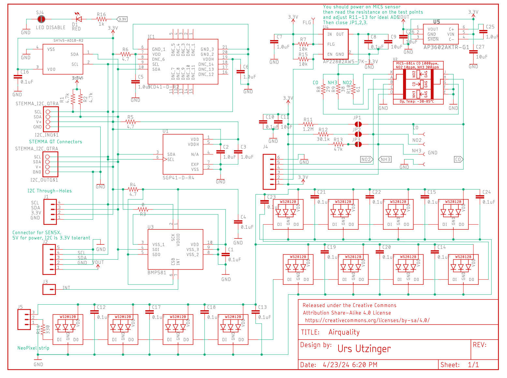
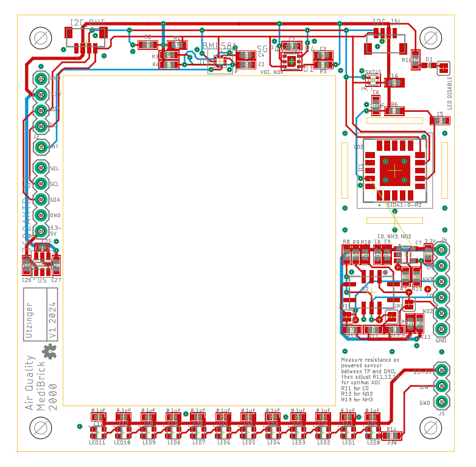

# Airquality

The airquality solution uses several sensors:

| Measurand | Sensors | Manufacturer | approx. Cost |
|---        |---      | ---          | ---  |
| Particulate Matter | Sensirion | [SEN50](datasheets/Sensirion_Datasheet_Environmental_Node_SEN5x.pdf) |  $22.20 |
| CO2               | Sensirion | [SCD40](datasheets/SCD4x_Ver1.4_Feb2023.pdf)| $29.70 |
| relative Humidity and Temperature |  Sensirion | [SHT45](datasheets/Datasheet_SHT4x_1.pdf) | $6.40|
| Temperature | Bosch | [BMP581](datasheets\bst_bmp581_ds004-2950309.pdf)| $4.20 |
| eVOC, eNOX | Sensirion | [SGP41](datasheets\Sensirion_Gas_Sensors_Datasheet_SGP41.pdf) | $9 |
| Carbon Monoxide, Amonia, Nitrogenoxide | Amphenol SGX Sensortech | [MiCS-6814 MEMS]((datasheets\1143_Datasheet-MiCS-6814-rev-8,pdf)) | $17 |
| Status Lights | XING Light | [Neopixel](datasheets\2301111010_XINGLIGHT-XL-2020RGBC-WS2812B_C5349955.pdf)| |

The MiCS sensor does not have an integrated analog to digital conversion and the device is measured with a resistor network. The datasheet shows operation at 5V. In this [document](MICS6814_on_3V.md) the calculations and illustration for the MiSC operating at 3V is explained. The nominal resistor values vary greatly and the detector needs tuning.

## Costs &#36;

| Item        | Quantity at Purchase | Costs  | Source            | Cost per Brick
|---                          | ---  | ---    | ---               | ---
| Microcontroller             |  1   | $17.5  | [Adafruit](https://www.adafruit.com/product/5477)          | $17.5
| Display                     |  5   | $13    | [Amazon](https://a.co/d/1QH0Ab9)            | $3
| Button                      | 25   | $9     | [Amazon](https://a.co/d/8KAuTwC) | $0.5 
| Battery                     |  1   | $10     | [Adafruit](https://www.adafruit.com/product/258)        | $10
| PCB                         |  5   | $45.20  | PCBWay            | $9
| Parts and Assembly          |  2   | $216.96 | PCBWay            | $109
| SEN50                       |  1   | $22.20  | [Mouser](https://www.mouser.com/ProductDetail/Sensirion/SEN50-SDN-T?qs=MyNHzdoqoQK%2F9NY8sYsxtw%3D%3D) | $22.20
| QWIIC cable                 |  1   | $1     | [Adafruit](https://www.adafruit.com/product/4210) | $1 |
| SEN5x cable                 | 1    | $1.50  | [Sparkfun](https://www.sparkfun.com/products/18079) | $1.50 
| Assorted Wires              |8m    | $15    | [Amazon](https://a.co/d/58djefc) | $1
| Assorted Screws and Nuts    |100   |  $7    | Amazon            | $0.05
| Assorted 3D printed parts   |      |        |                   | $3
|                             |      |        |                   |
| **Total**                   |      |        |                   | **$180**

*Electronic components excluding SEN50 are $128 per board. 

The airquality solution has been optimized for accuracy and not cost. There are sensor options for half or third of the price but they require a different board design.

## Test Software &#128187;
Test software is located in the Arduino folder.

| Folder | Description | 
|--- |---|
| MediBrick_Env_CO2_SCD4x           | CO2 sensor test             |
| MediBrick_Env_Humidity_SHT_Test   | Humidity and Temperature test |
| MediBrick_Env_PM_SEN5x_Test       | Particulate Matter test     |
| MediBrick_Env_VOC_NOx_SGP41_Test  | eVOC and NOx test           |
| MediBrick_Env_NeoPixel_Test       | RGB LED indicator test      |
| Not yet available                 | MiCS CO, Amonia Sensor, NOx test | 
## Microcontroller Software : &#9000;
An integrative software reading all sensors is not finalized yet.

## Electronics Design &#128268;

The particulate matter sensor is placed in the middle of the PCB and should not touch the PCB to avoid vibrations on the CO2 sensor.

The following files are needed for PCB manufacturing and assembly.

- [Bill of Materials](Air_Quality_BOM.xlsx)
- [Manufacturing Files](Air_Quality_2024-08-24.zip)
- [Pick and Place](Air_Quality_PnP.xlsx)

The Bill of Materials is formatted so that its compatible with PCBWay submissions.

## 3D Printed Parts &#9881;
These are the links to the OnShape Design files, which you can edit and modify if you have an OnShape account (OnShape has free academic accounts).

- Medi Brick
  - [Brick Top](https://cad.onshape.com/documents/be6b7e5f847d89f3ec5eb9d5/w/761fee9865ca7ef709028476/e/ff897b4f359cec83b782ff14)
  - [Brick Bottom](https://cad.onshape.com/documents/92ad78475e8f0b17ff5e260b/w/88a02abbcb12cdbd4d9de3ad/e/fb79ca58ad2b6a0298e9d1b6)
  - [Brick Assembly](https://cad.onshape.com/documents/11cbfe9c3c739b6e8ecbf3d7/w/989b564ecd7f6d069e643ac0/e/85542f706be8cc7554218e8d)
  - [Air Quality Brick Side Plate](https://cad.onshape.com/documents/6f9a87cae125641fc3a0651c/w/6e25f32c6ac446efd4e51be7/e/7a2fa3c5e053c8442ada89bd)

