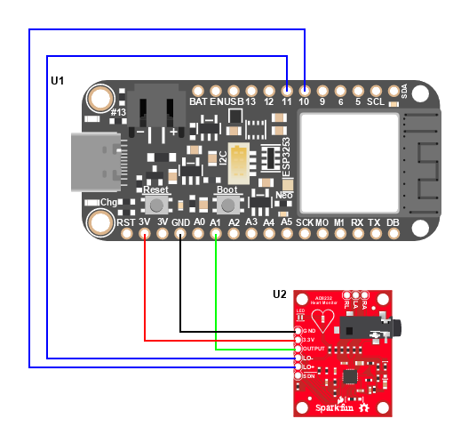

This is a description for ECG Sensor from the capstone project: https://github.com/grender007/Modular-Biomedical-Sensor-Board-for-Education

The ECG Module takes advantage of the Sparkfun ECG Pre-Amplifier Board. It uses the AD8232 IC to detect the voltage potential of the heart. 
The microcontroller's analog to digital converter is needed to record the signal.

 
