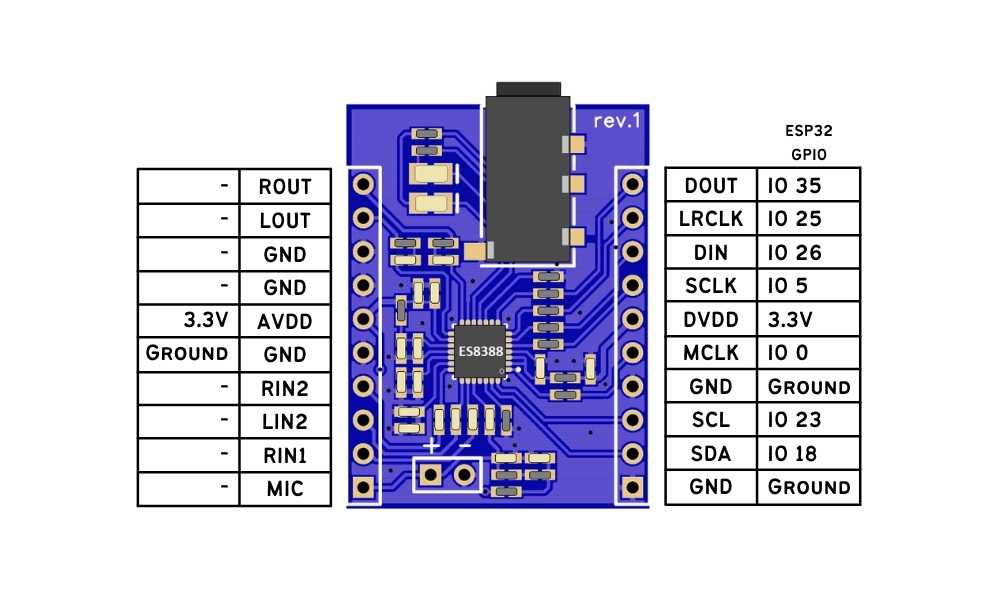

# [ES8388 PCB Artist Audio Board](https://pcbartists.com/es8388/)

## Connecting the Audio Board to ESP32



| Name | ESP32 S3 | ES8388   | ES8388 | ESP32 S3 | Name  |
|---   |---       |---       |---     |---       |---    |  
| R    | NC       | ROUT     | DOU    | 37/MI    | D OUT |
| L    | NC       | LOUT     | LRCLK  | A5/8     | WS/Word CLK |
| GND  | NC       | GND      | DIN    | 35/MO    | D IN  |
| GND  | GND      | GND      | SCLK   | 36/SC    | Bit CLK |
| 3.3  | 3.3      | AVDD     | DVDD   | 3.3      | 3.3   |
| GND  | NC       | GND      | MCLK   | A4/14    | Master CLK  |
| RI   | NC       | RIN2     | GND    | NC       | GND   |
| LI   | NC       | LIN2     | SCL    | 4        | SCL   |
| RI   | NC       | RIN1     | SDA    | 3        | SDA   |
| MIC  | MIC      | LIN1/MIC | GND    | NC       | GND   |


## Audio Driver

```
  // Setup Pins
  // - add i2c codec pins: scl, sda, port, (I2C object)
  // i2c scan will report 0x10 address but Phil includes the readbit also
  my_pins.addI2C(PinFunction::CODEC, 4, 3, 0x20, 100000, Wire);
  // - add i2s pins:                 mclk, bclk, ws, data_out, data_in
  my_pins.addI2S(PinFunction::CODEC,   14,   36,  8,       37,      35);
  ```
