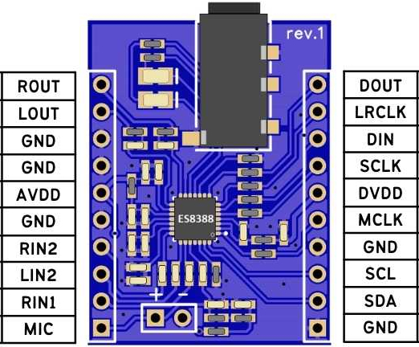

# [ES8388 PCB Artist Audio Board](https://pcbartists.com/es8388/)

Here we describe the connection between the PCB Artist baord with the EPS32 S3 and the corresponding settings in the AudioTools library.

## Connecting the Audio Board to ESP32 S3



| Name | ESP32 S3 | ES8388   | ES8388 | ESP32 S3 | Name  |
|---   |---       |---       |---     |---       |---    |  
| RO   | NC       | ROUT     | DOU    | 37/MI    | D OUT |
| LO   | NC       | LOUT     | LRCLK  | A5/8     | WS/Word CLK |
| GND  | NC       | GND      | DIN    | 35/MO    | D IN  |
| GND  | GND      | GND      | SCLK   | 36/SC    | Bit CLK |
| 3.3  | 3.3      | AVDD     | DVDD   | 3.3      | 3.3   |
| GND  | NC       | GND      | MCLK   | A4/14    | Master CLK  |
| RI   | NC       | RIN2     | GND    | NC       | GND   |
| LI   | NC       | LIN2     | SCL    | 4        | SCL   |
| RI   | NC       | RIN1     | SDA    | 3        | SDA   |
| MIC  | NC       | LIN1/MIC | GND    | NC       | GND   |

$MIC_1$ is connected to MIC.
$MIC_2$ is connected to RI.
R/LO are routed.
R/LI are routed.


## Audio Driver Setup

```
#include "AudioTools.h"
#include "AudioLibs/I2SCodecStream.h"

// I2C
#define SDAPIN               3
#define SCLPIN               4
#define I2CSPEED        100000
#define ES8388ADDR        0x10

// I2S
#define MCLKPIN             14
#define BCLKPIN             36
#define WSPIN                8
#define DOPIN               37
#define DIPIN               35

AudioInfo                     audio_info(44200, 2, 16);
SineWaveGenerator<int16_t>    sine_wave(32000);
GeneratedSoundStream<int16_t> sound_stream(sine_wave);
DriverPins                    my_pins;
AudioBoard                    audio_board(AudioDriverES8388, my_pins);
I2SCodecStream                i2s_out_stream(audio_board);
StreamCopy                    copier(i2s_out_stream, sound_stream);
TwoWire                       myWire = TwoWire(0);

void setup() {

  Serial.begin(115200);
  AudioLogger::instance().begin(Serial, AudioLogger::Warning);
  LOGLEVEL_AUDIODRIVER = AudioDriverWarning;
  delay(2000);

  Serial.println("Setup starting...");

  my_pins.addI2C(PinFunction::CODEC, SCLPIN, SDAPIN, ES8388ADDR, I2CSPEED, myWire);
  my_pins.addI2S(PinFunction::CODEC, MCLKPIN, BCLKPIN, WSPIN, DOPIN, DIPIN);

  my_pins.begin();
  audio_board.begin();
  auto i2s_config = i2s_out_stream.defaultConfig();
  i2s_config.copyFrom(audio_info);  
  i2s_out_stream.begin(i2s_config);
  sine_wave.begin(audio_info, N_B4); // 493.88 Hz

  Serial.println("Setup completed ...");
}

// Arduino loop - copy sound to out
void loop() { copier.copy(); }
```

