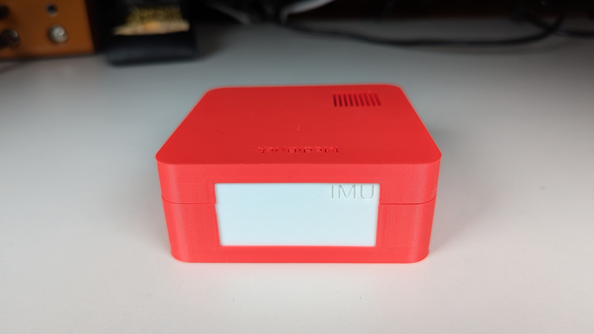
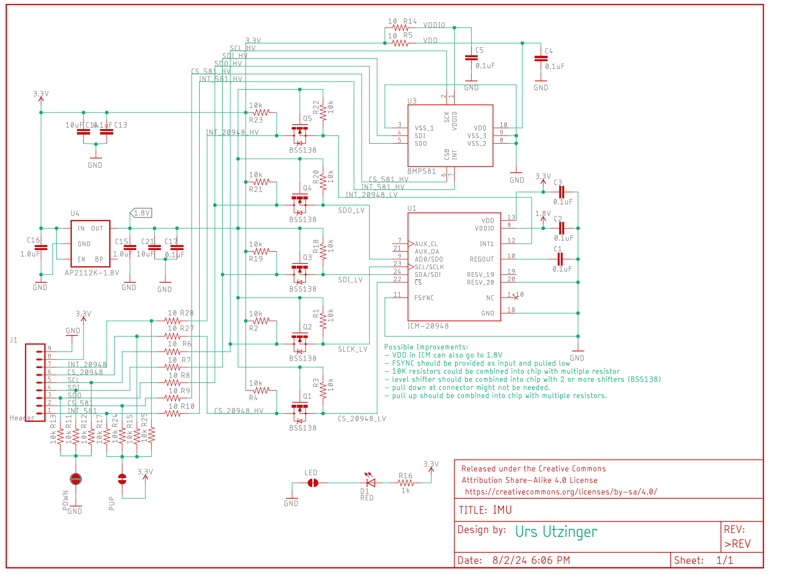
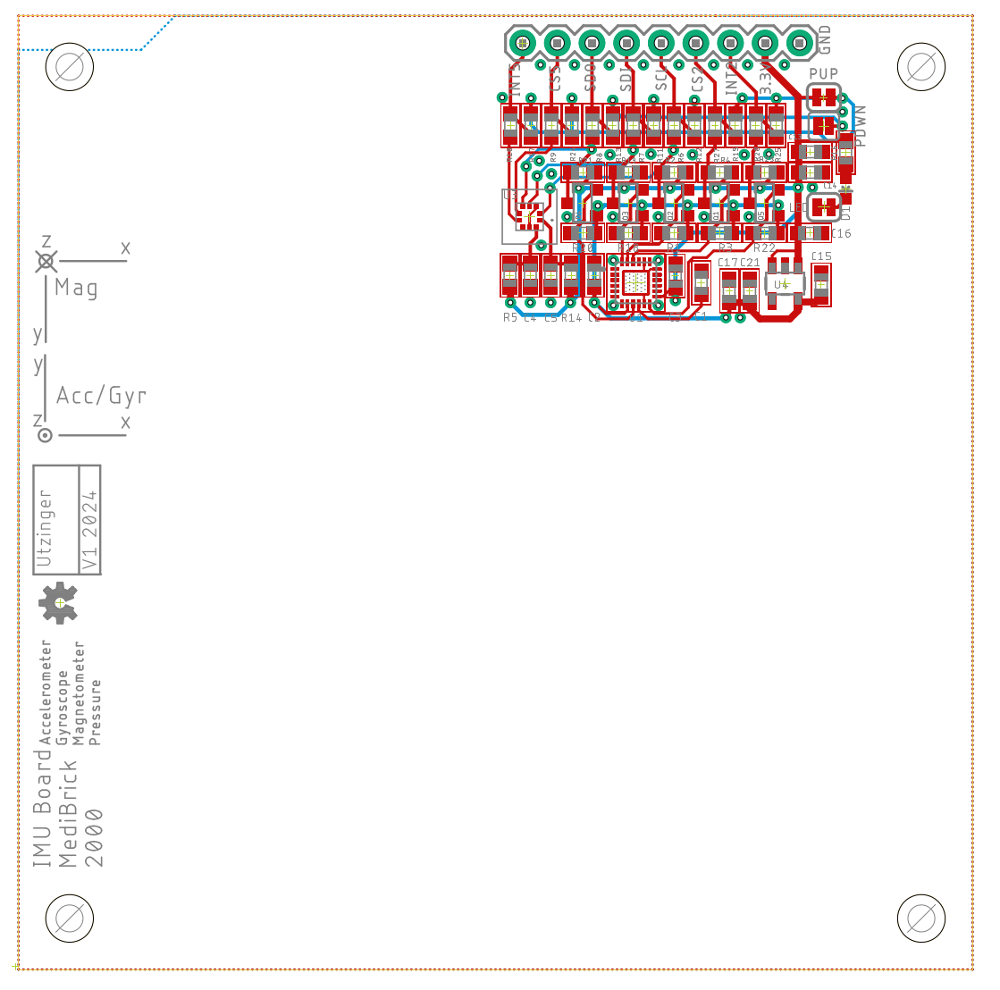

# IMU MediBrick

# Thermistor/Wheatstone Brick

This board is based on latest TDK IMU [ICM20948](datasheest/DS-000189-ICM-20948-v1.3.pdf) and BOSCH precision pressure sensors [BMP581](datasheets/BSS138-D.pdf) and uses SPI interface accommodating a sampling rate exceeding 1000 samples per second.

## Costs &#36;

| Item        | Quantity at Purchase | Costs  | Source            | Cost per Brick
|---                          | ---  | ---    | ---               | ---
| Microcontroller             |  1   | $17.5  | [Adafruit](https://www.adafruit.com/product/5477)          | $17.5
| Display                     |  5   | $13    | [Amazon](https://a.co/d/1QH0Ab9)            | $3
| Button                      | 25   | $9     | [Amazon](https://a.co/d/8KAuTwC) | $0.5 
| Battery                     |  1   | $10     | [Adafruit](https://www.adafruit.com/product/258)        | $10
| PCB                         |  5   | $45.20  | PCBWay            | $9
| Parts and Assembly          |  2   | $51.87* | PCBWay            | $26
| Assorted Wires              |8m    | $15    | [Amazon](https://a.co/d/58djefc) | $1
| Assorted Screws and Nuts    |100   |  $7    | Amazon            | $0.05
| Assorted 3D printed parts   |      |        |  | $3
|                             |      |        |                   |
| **Total**                   |      |        |                   | **$70**

*Electronic components are $11 per board. 

## Test Software &#128187;
Test software is located in the Arduino folder.

| Folder | Description | 
|--- |---|
|MediBrick_IMU_ICM20948_DMP_Test | IMU with onboard attitude calculation. |
|MediBrick_IMU_P_BMP581_Interrupt| Pressure sensor with interrupt. |

## Microcontroller Software : &#9000;
Not finalized yet

## Electronics Design &#128268;

The following files are needed for PCB manufacturing and assembly.

- [Bill of Materials](IMU_BOM.xlsx)
- [Manufacturing Files](IMU_2024-08-03.zip)
- [Pick and Place](IMU_PnP.xlsx)

The Bill of Materials is formatted so that its compatible with PCBWay submissions.

## 3D Printed Parts &#9881;
These are the links to the OnShape Design files, which you can edit and modify if you have an OnShape account (OnShape has free academic accounts).

- Medi Brick
  - [Brick Top](https://cad.onshape.com/documents/be6b7e5f847d89f3ec5eb9d5/w/761fee9865ca7ef709028476/e/ff897b4f359cec83b782ff14)
  - [Brick Bottom](https://cad.onshape.com/documents/92ad78475e8f0b17ff5e260b/w/88a02abbcb12cdbd4d9de3ad/e/fb79ca58ad2b6a0298e9d1b6)
  - [Brick Assembly](https://cad.onshape.com/documents/11cbfe9c3c739b6e8ecbf3d7/w/989b564ecd7f6d069e643ac0/e/85542f706be8cc7554218e8d)
  - [IMU Brick Side Plate](https://cad.onshape.com/documents/eb58e78174fdb2053487973b/w/903e17c4126fb90e8782ab92/e/f4b50a954b0de64bf397a15c?renderMode=0&uiState=6712e42015dc976491f468b3)

