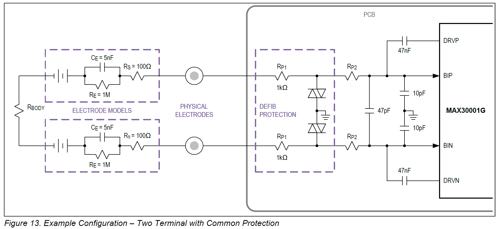
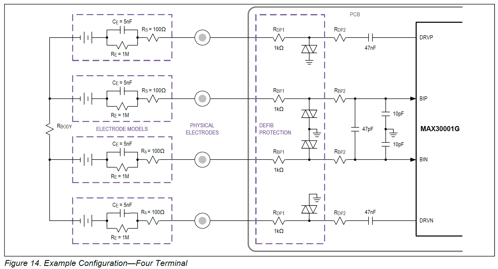

# MAX 30001G

Here we summarize the features and design consideration of the MAX 30001G. This should shorten the read of the datasheet.

**ECG/Biopotential:** 
Common Mode Rejection is 100dB. Noise is $4.6\mu V_{p-p}$ at $0.05-150Hz$ bandwidth. It sues a  18bits ADC at 125-512 samples per second. Built in digital highpass ($0.5Hz$) and lowpass ($40$, $100$ or $150Hz$) filter as well as R-R time measurement unit for heart reate measurement.

**Impedance:**
Uses a square wave generator with $100nA$ or $8-96 \mu Amp$ operating at $0.125-131kHz$. The ADC operates 20bits and 25-64 samples per second. Noise is $1.1 \mu V_{p-p}. Output digital filters are available to create a low pass at $4$, $8$ or $16Hz$ and a high pass at $0.05$ or $0.5 Hz$.

SPI communication can occur at >0-12MHz.

The device operates on 1.8V and can produce 3.3V digital output signals for SPI as well as interrupts.

This chip comes only in Waver Level Packing [WLP] which has a 0.5mm pad pitch and a 0.25mm pad size. This results in highest level of difficulty for soldering as alignment will need to be at 0.1mm.

## MAX 30001G ECG Channel

The ECG channel consist of an input MUX to switch between leads, instrumentation amplifier, anti alias filter (3dB at 600Hz) for ADC and a programmable gain amplifier. The input MUX has ESD protection and EMI filtering and can detect wether leads are on or off. CAPP and CAPN provide external capacitor connection to set the amplifiers' low pass filter. Other functions are enabled internally.

The is leads-off detection while measuring and leads-on detection while the ECG channel is powered down. For leads-on detection a selectable current 0-100nA is applied to the leads and if the voltage is below a threshold for more than 140ms, the off conditions is met. When impedance between ECGP and ECGN is less then 40M Ohm a leads-on interrupt is triggered.

Common mode between ECGP and ECGN should not exceed 550mV when the chip is run at 1.8V. This can be achieved with internal lead biasing. Optionally, VCM can be connected with a third electrode to the body to create common voltage on the skin surface.

Calibration voltage sources are available to calibrate the ECG channels at $0.015 - 256 Hz$ and $+/-0.25$ or $0.5mV$ amplitude.

A high pass filter can be attached to CAPP and CAPN which results in a low pass frequency of $f_c = 1 / (2 \pi R C)$ where R is approximately $450k Ohm$. If C is $10\mu F$ $f_c$ is $0.035 Hz$.

The built in anti aliasing filter is a 2 pole active filter with f_c at 600Hz.

The instrumentation amplifier has a GAIN register.

Before ADC the signal is amplified by 1, 2, 4 or 8 resulting in total amplification of $20$, $40$, $80$ or $160$ V/V.

The converted data is 18 bit left justified two's complement. After converting to signed magnitude one obtains the actual signal with 

$V_{ECG}=ADC*V_{REF}*/2^{17} * ECG_{GAIN}$ 

where $V_{REF}$ is typically $1000mV$.

At 512 samples per second the output latency is $20-32 ms$ where as $32ms$ represents the condition when the digital low pass filter is engaged.

R-R detection is possible with Pan-Tompkins QRS detection algorithm. Timing accuracy is about 8ms. The latency of the algorithm is about 100 ms.

## MAX 30001G BioZ Channel

The bio impedance channel consists of a driver and an input chain. The input mux measures the two input electrodes with a multiplexer and provides ESD and EMS protection. It can also detect leads-on and off condition.  The signal passes a high pass filter followed by an amplifier and is then demodulated with the driver signal at a selectable phase offset. After an anti-aliasing filter at 600Hz the signal is converted to digital.

There are 3 methods to detect leads off. 

The compliance to generating current in the driver is monitored and triggered when voltage is out of expected range (enabled with BIOZ_CGMON). 

There is lead-off detection on the BIP and BIN leads operating the same way as in ECGP and ECGN.

Common Mode on BIP and BIN is limited to 550mV when operating the chip at 1.8V. Internal bias can be applied to BIP and BIN or VCM can be used to generate common mode on the skin.

Calibration voltage sources similar to the ECG cahnnel are available.

Internal calibration resistors are available for DRVP and DRVN to test driver functionality.

The current generator on DRVP and DRVN is a square wave modulation that is AC injected in to the body. In high current mode $8-96\mu A$ we need to attach a 324k Ohm resistor to $R_{BIAS}$. Both active and resistive common mode feedback is available. Current injection frequencies are 125Hz to 132kHz. A programmable resistor is used to adjust the injected current.

ADC operates at 20 bits and results in a left justified two's complement number. After signed magnitude conversion,

$BioZ = ADC x V_{REF} / (219 x BIOZ_{CGMAG} x BIOZ_{GAIN})$ in [Ω].

$V_{REF}$ typically is 1V.  $BioZ_{CGMAG}$ is $50 nano$ to $96 \mu A$ and $BIOZ_{GAIN}$ is $10$, $20$, $40$, or $80V/V$.

## Computing and Configuring Impedance

To calculate the body impedance, one needs to analyze all electrical components in the network. An electrode model should be used for example Model 1 mentioned above with values from the MAX datasheet.

### 2 Lead Measurement

(from MAX30001G data sheet)

DRVP and DRVN are connected to BIN and BIP with $0.47nF$ capacitors (close jumpers DN-BN and DP-BP in our design). (Need to change design to match capacitors). BIN and BIP have default capacitors attached: 10pF and 47pF.

The total impedance on BIP and BIN is:

$R_{BODY} + 2 R_{P1} + 2 R_{P2}+ 2 R_S + Re (2R_E * 1 / (1+jωR_E C_ E))$

Where Re is the real part and is:

$2R_E * 1 / (1+(ωR_E C_ E)^2)$ 

with $ω = 2 \pi f$

In our design $R_{P1}$ and $R_{P2}$ are 0. At 80kHz $R_{BODY}$ is about 100 Ω and therefore the equation above results in and impedance of about 300 Ω (C_E and R_E are negligible).

The maximum current injection is the maximum AC input differential range ($90mV_{peak}$) divided by the network impedance (300 Ω) or 300 micro Amp. The closes selectable current the system can generated is $96 \mu A_{peak}$.

### 4 Lead Measurement

(from MAX30001G data sheet)

There is no difference in calculating the real part of the impedance on BP and BN.

The maximum current for injection is the DRVP DRVN compliance voltage (VDD-0.5V = 1.1V for VDD = 1.8V) divided by the network impedance ($300 Ω$) or $4.3mA$. The closest selectable current is again $96 \mu A_{peak}$.

### Rest of circuit

The high-pass filter options include a fourth-order IIR Butterworth filter with a $0.05Hz$ or $0.5Hz$ corner frequency along with a pass through setting for DC coupling.

Low pass filter options include a 12-tap linear phase (constant group delay) FIR filter with $4$, $8$, or $16Hz$ corner frequencies.

The shortest latency is $100ms$ without filter and $200ms$ with filter.
