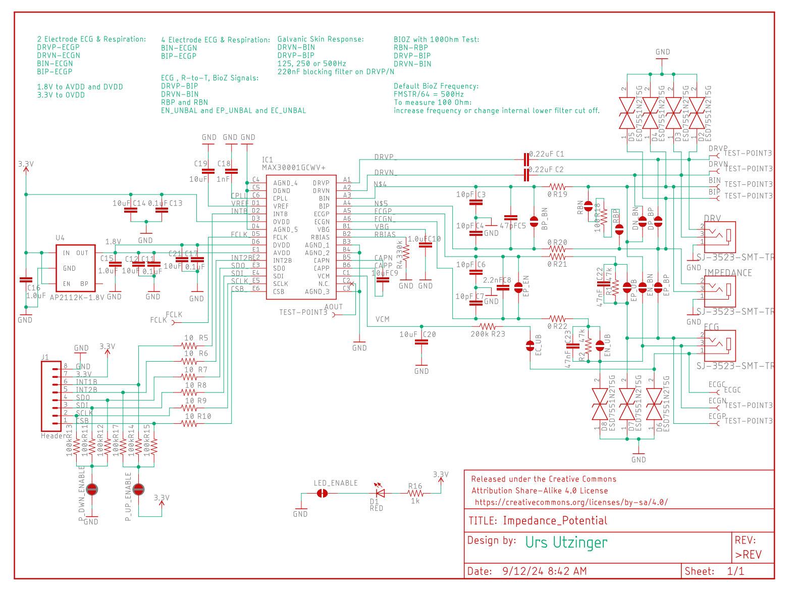
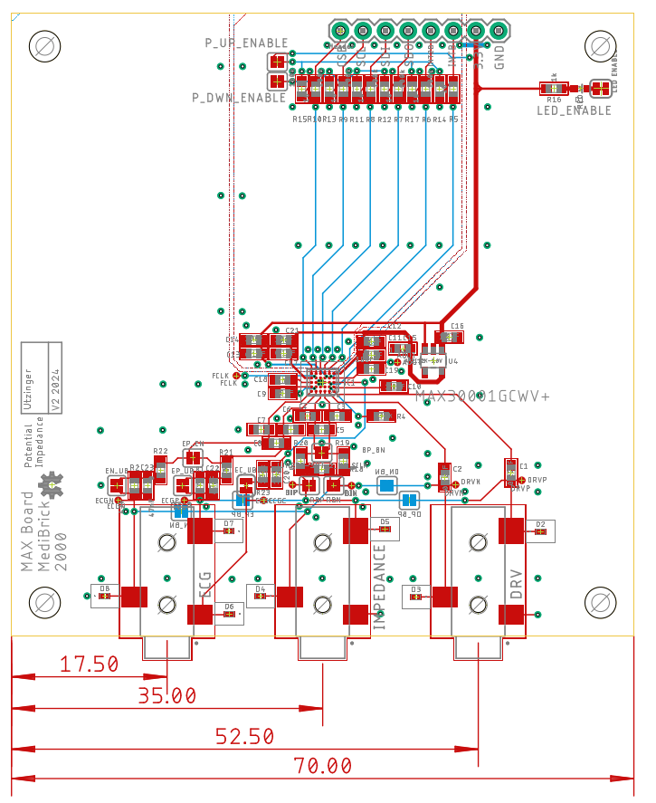
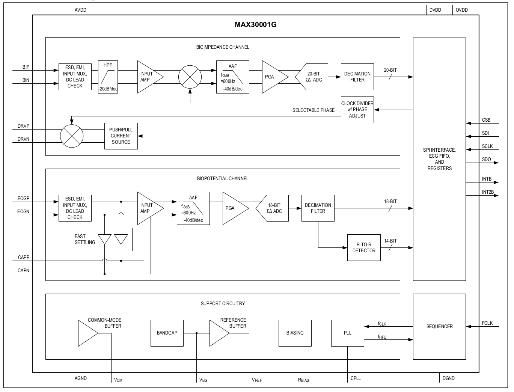

# Bio Impedance and Bio Potential

For general consideration of bio impedance design and safety: [Analog Devices: Bio-Impedance Circuit Design for Body Worn Systems"](https://www.analog.com/en/resources/analog-dialogue/articles/bioimpedance-circuit-design-challenges.html)

For BIOZ and ECG MediBrick we use the MAXIM [MAX30001G](datasheets/max30001g.pdf) analog front end (AFE). It's a modern design with a "waver level packaging" foot print of the sensor which makes is difficult to solder and increases costs for PCB manufacturing.

The MAX30001G can measure:

- Biopotential
  - ECG (waveform)
  - R-R Time (heart rate and heart rate variability)
- Bioimpedance
  - Resp (respiration rate)
  - GSR (galvanic skin response, stress level)
  - EDA (electro dermal activity)

Here [MAX3001G](MAX30001G.md) we summary capabilities from datasheet.

## Assembly &#128736;

See separate [Assembly Instructions](assembly.md).

## Costs &#36;

| Item        | Quantity at Purchase | Costs  | Source            | Cost per Brick
|---                          | ---  | ---    | ---               | ---
| Microcontroller             |  1   | $17.5  | [Adafruit](https://www.adafruit.com/product/5477)          | $17.5
| Display                     |  5   | $13    | [Amazon](https://a.co/d/1QH0Ab9)            | $3
| Button                      | 25   | $9     | [Amazon](https://a.co/d/8KAuTwC) | $0.5 
| Battery                     |  1   | $10     | [Adafruit](https://www.adafruit.com/product/258)        | $10
| PCB                         |  5   | $145.80 | PCBWay            | $29
| Parts and Assembly          |  5   | $186.42 | PCBWay            | $38
| Assorted Wires              |8m    | $15    | [Amazon](https://a.co/d/58djefc) | $1
| Assorted Screws and Nuts    |100   |  $7    | Amazon            | $0.05
| Assorted 3D printed parts   |      |        |                   | $3
| ECG 3.5mm cables | 1  | $5.50 | [Sparkfun](https://www.sparkfun.com/products/12970) | $5.50
| Electrodes (consumable) | 100 | $25 | [Amazon](https://a.co/d/85M2rC2) | $ 1
|                             |      |        |                   |
| **Total**                   |      |        |                   | **$110**

Electronic components are $20 per board. Because of WLP foot print of MAX30001G the PCB is 3 times as expensive as the other PCBs.

## Test Software &#128187;
Test software is located in the Arduino folder.

| Folder | Description | 
|--- |---|
| MAX30001G Driver | under development |
| not available yet | Test programs |

## Microcontroller Software : &#9000;
Not available yet.

## Electronics Design &#128268;

The following files are needed for PCB manufacturing and assembly.

- [Bill of Materials](Impedance_Potential_BOM.xlsx)
- [Manufacturing Files](Impedance_Potential_2024-09-12.zip)
- [Pick and Place](Impedance_Potential_PnP.xlsx)

The Bill of Materials is formatted so that its compatible with PCBWay submissions.

## 3D Printed Parts &#9881;
These are the links to the OnShape Design files, which you can edit and modify if you have an OnShape account (OnShape has free academic accounts).

- Medi Brick
  - [Brick Top](https://cad.onshape.com/documents/be6b7e5f847d89f3ec5eb9d5/w/761fee9865ca7ef709028476/e/ff897b4f359cec83b782ff14)
  - [Brick Bottom](https://cad.onshape.com/documents/92ad78475e8f0b17ff5e260b/w/88a02abbcb12cdbd4d9de3ad/e/fb79ca58ad2b6a0298e9d1b6)
  - [Brick Assembly](https://cad.onshape.com/documents/11cbfe9c3c739b6e8ecbf3d7/w/989b564ecd7f6d069e643ac0/e/85542f706be8cc7554218e8d)
  - [Impedance Potential Plate](https://cad.onshape.com/documents/4b23bdc1fe41aa5490b46d9c/w/fd4737f6a1ca7fbcd3b1d7f7/e/89122d5ddac798ebf451ad60)

## MAX30001G Design

## Block Diagram of MAX 30001G

## External Configuration Options

We have the following external connectors:
- ECG, 3,5mm audio
    - ECG_N (middle of plug) e.g. left arm
    - ECG_P (proximal side of plug) e.g. right arm
    - VCM/ECG_GND (common mode) (tip of plug) e.g. leg

- Impedance, 3.5mm audio
    - BI_N
    - BI_P
    - GND (tip of plug)

- Driver, 3.5mm audio
    - DRV_P
    - DRV_N
    - GND (tip of plug)

### Options
- We can operate the board to measure ECG or Impedance or both. 
- We can operate the board to use only two leads, four leads or six leads. 
    - 6 leads ECG on ECGP & ECGN, BIOZ on BINP & BINN and DRV on DRVP & DRVN
    - 4 leads ECG on ECGP & ECGN, BIOZ on BINP & BINN
    - 2 leads ECG, BIOZ, DRV on ECGP & ECGN
- We can configure the board to measure impedance of a calibration resistor that is soldered onto the board (100 Ohm).

### Component Values

Typical values and conditions of external components

Name      | typical value | Comment
----------|---------------|--------
C_ECG     | 2.2nF         | datasheet
C_ECG-G   | 10pF          | datasheet, 47pF protocentral
EP_EN     | open          | disable ECG
R_ECG     | 0,51k,200k Ohm | 0, 200k shown in datasheet (200k when ECG conencted with BIOZ), 51k protocentral, 0 Ohm evaluation kit
R_ECG-B   | 51k           | evaluation kit
C_ECG_B   | 47nF          | evaluation kit
ECG_UNBAL | open          | disable balancing by closing
||
EP_BP     | open          | Impedance and ECG is on same plug
EN_BN     | open          | Impedance and ECG is on same plug
||
C_BIN     | 47pF          | datasheet
C_BIN_G   | 10pF          | datasheet
BP_BN     | open          | disable BioZ
R_BIN     | 0, 200 Ohm    | 200 protocentral where ECG is connected to BIN, 0 evaluation kit
R_CAL     | 100 Ohm       | evaluation kit
RP        | open          | if closed no external impedance
RN        | open          | "
||
BP_DP     | open          | Impedance and Driver on same plug
BN_DN     | open          | Impedance and Driver on same plug
||
C_DRV     | 200nF, 47nF   | 47nF protocentral, 47nF evaluation kit
||
R_VCM     | 0 Ohm,10k,200k| 10k protocentral, evaluation kit has buffer driver cirtuit, 200k datasheet
R_VCM-B   | 51k, none     | none potocentral & evaluation kit
C_VCM-B   | 47nF, none    | none protocontral & evaluation kit, 47nF datasheet
VMC_UNBAL | open          | 

Specifically: 

### Configuration of Protocentral 30001 Break Out
Single Connector

- VCM **10k** in series, no capacitor in series
- VBG same circuit and capacitors
- RBIAS same circuit, resistor value not given
- CAPN, CAPP same circuit, same capacitor
- DRVN, DRVP same circuit **47nF** in stead of 220nF
- DRVN, DRVP, hardwired to ECGN and ECGP
- BINN, BINP same design, no calibration resistor, 
- BINN, BINP hardwired to ECGN and ECGP
- ECGN, ECGP same design 47pF to GND instead of 10pF, 51k inline but no capacitor
- OVDD on 1.8V, logic level conversion to 3.3V
- no over voltage protection

### Configuration of Protocentral tinyECG
ECG and BIOZ different connectors, DRV and BIN on the same connector

- VCM **10k** in series instead of 51k, no capacitor in series
- VBG same circuit and capacitors
- RBIAS same circuit, resistor value not given
- CAPN, CAPP same circuit, same capacitor
- DRVN, DRVP same circuit **47nF** in stead of 220nF
- BINN, BINP same design, no calibration resistor, 
- BINN, BINP hardwired to DRVN and DRVP
- BINN, BINP **200** Ohm resistor instead of 0 Ohm R19, R20
- ECGN, ECGP same design **47pF** to GND instead of 10pF, same inline resistor but no capacitor
- OVDD on 3.3V
- no over voltage protection

### Configuration of Evaluation Kit
- VCM **10k** in series instead of 51k, no capacitor in series, additional offset option
- VBG same circuit and capacitors
- RBIAS same circuit, resistor value not given
- CAPN, CAPP same circuit, same capacitor
- DRVN, DRVP same circuit, 47nF in general example, 220nF BioZ, GSR
- BINN, BINP same design
- BINN, BINP jumper option to DRVN and DRVP
- BINN, BINP 0 Ohm R19, R20
- ECGN, ECGP same design, same inline resistor and capacitor
- ECGN, ECGP jumper option to BINN, BINP
- OVDD on 3.3V
- no over voltage protection

### Configuration form Datasheet for typical ECG and GSR
- VCM **200k** in series instead of 51k, no capacitor in series
- VBG same circuit and capacitors
- RBIAS same circuit, same 324k resistor
- CAPN, CAPP same circuit, same capacitor
- DRVN, DRVP same circuit, 47nF 
- BINN, BINP separate connector
- BINN, BINP same design
- BINN, BINP resistor not specified Ohm R19, R20
- ECGN, ECGP same design
- ECGN, ECGP connected to BINN, BINP
- OVDD up to 3.6V

### Configuration from Datasheet for typical simple ECG
- ECG direct with protection resistor, no capacitor network
- no DRV and BIN connection

