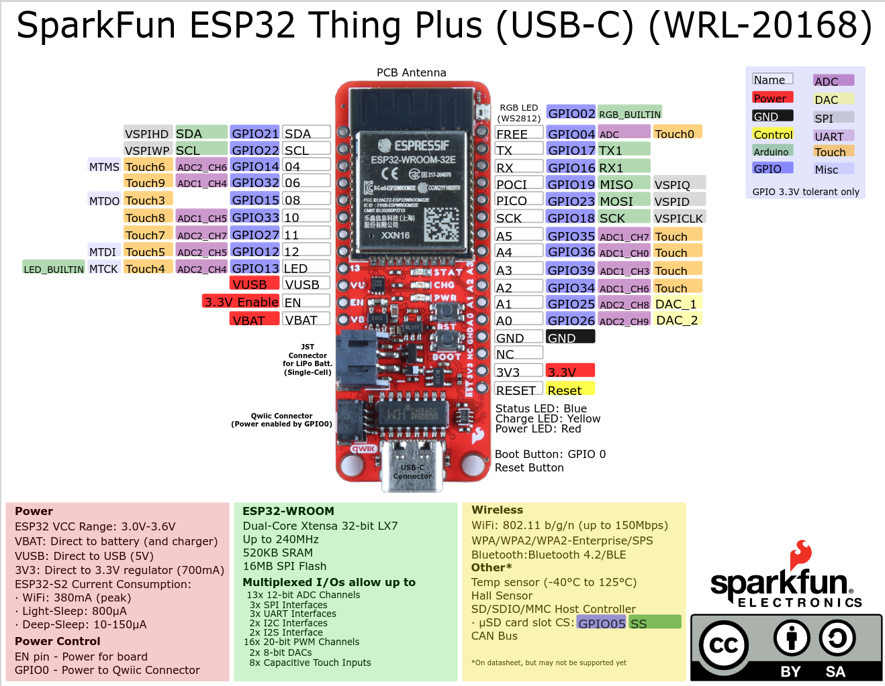

# Assembly of ECG and BioZ Brick

## Soldering

### 3.5mm Connector
Firmly press the 3.5mm connector into the holes and solder all three pins.

### Wires
Attach color coded wires to the IO pads. E.g. red for power, black or green for ground and blue or white for digital input/output.

You can insert the wires into the holes (perpendicular) or or you can attach a short piece of the wires on top of the pad (perpendicular).

Suggested connecctions for the Sparkfun Thing Plus (USB-C) and the Adafruit Feather ESP32-S3 are below:

PAD       | Function                  | Thing Plus  | Feather
---       |---                        |---          |---
**VCC**   | Power                     | 3V3         | 3V3 
**GND**   | Power                     | GND         | GND
**CS0**   | Chip Select               | 08   GPIO15 | 6
**SDI***  | Master Out Slave In       | PICO GPIO23 | MO
**SDO***  | Master In Salve Out       | POCI GPIO19 | MI
**SCL**   | Serial Clock              | SCK  GPIO18 | SCK
**INTB**  | Interrupt Output          | 12   GIPO12 | 12 GPIO12
INT2B     | Interrupt 2 Output        | 11   GIPO27 | 13 GPIO13

Pin 10 (Feather, Thing Plus)  is reserved for system button.
Require connections are in **bold**.

*The MAX30001G Analog Front End uses the MOSI and MISO on diagrams showing a microcontroller. POCI and PICO should be used for "peripheral out controller in" and "peripheral in controller out".

## Board Configuration

There are many configurations we can select. We can operate the board to measure ECG or Impedance or both. We can operate the board to use only two leads, four leads or six leads. We can configure the board to measure impedance of a calibration resistor that is soldered onto the board (100 Ohm).

### Jumpers

There are 4 sets of jumper:

1) The following jumpers are available to reduce the numnber of required leads. They create direct conenction between the pins of the plug and the chip IO:

    For single plug operation ECG&BioZ
    - $ECG_N$ to $BI_N$
    - $ECG_P$ to $BI_P$

    For single plug BioZ operation
    - $DRV_N$ to $BI_N$
    - $DRV_P$ to $BI_P$

2) The unbalance filters for Input and Offset can be bypassed. Those are the two input pins for ECG, Bioimedance and VCM :

    - $VCM_{UB}$: $VCM$ unbalance bypass
    - $EN_{UB}$: $ECG_N$ unbalance bypass
    - $EP_{UB}$: $ECG_P$ unbalance bypass

3) We can also disable input:

    - $ECG_P$ to $ECG_N$ (this shorts N and P terminal together, for BIOZ measurements only operation)
    - $BI_P$ to $BI_N$ (this shorts N and P terminal together, for ECG measurements only operation)

4) We can calibrate BIOZ with a 100 Ohm resistor:

    - $R_N$, $R_P$ connect $BI_N$, $BI_P$ to 100 Ohm (R18), for testing purose only, once conencted no external impedance can be measured.

If $V_{CM}$ is used for ECG right leg bias, internal lead bias needs to be disabled. Resistor can be 10k..200kOhm.

For specific hardware configuration setup the following jumpers should be set:

### Configuration Options

Configuration          | $ECG_P$ to $ECG_N$ | $DRV_N$ to $BI_N$ | $DRV_P$ to $BI_P$ | $ECG_N$ to $BI_N$ | $ECG_P$ to $BI_P$ | $R_N$ | $R_P$ | $VCM_{UB}$ | $EN _{UB}$ | $EP_{UB}$ |
-----------------------|--------------------|-------------------|-------------------|-------------------|-------------------|-------|-------|------------|------------|-----------|
(1) 100 Ohm Test       |                    | X                 | X                 |                   |                   | X     | X     |            |            |           | 
(2) ECG, R to R        |                    |                   |                   |                   |                   |       |       | *          |            |           | 
(3) ECG & Resp 2 leads |                    | X                 | X                 | X                 | X                 |       |       | *          |            |           | 
(4) ECG & Resp 4 leads |                    |                   |                   | X                 | X                 |       |       | *          |            |           | 
(5) GSR                | X                  | X                 | X                 |                   |                   |       |       |            |            |           | 
(6) BIOZ 2 leads       | X                  | X                 | X                 | X                 | X                 |       |       |            |            |           | 
(7) BIOZ 4 leads       | X                  |                   |                   |                   |                   |       |       |            |            |           | 
(8) BIOZ & ECG 2 leads |                    | X                 | X                 | X                 | X                 |       |       | *          |            |           | 
(9) BIOZ & ECG 4 leads |                    | X                 | X                 |                   |                   |       |       | *          |            |           | 
(10) BIOZ & ECG 6 leads|                    |                   |                   |                   |                   |       |       | *          |            |           | 

(X) = solder jumper closed

(*) Might need to replace R23 with 200kOhm and enable VCM bypass by soldering the jumper close.

### Lead Connections

(1) **100 Ohm BioZ Test**

    - 100 Ohm test for Driver and Impedance (BioZ)
    - No external BIOZ leads possible
    - ECG Measurement leads on ECG connector possible
    - BioZ frequency is FMSTR/64 = 500Hz
    - Increase frequency or change internal lower filter cut off

(2) **ECG** 

    - Measurement Leads on ECG connector.

(3) **2 Leads ECG**

    - Measurement Leads on ECG connector.

(4) **4 Leads ECG**

    - Driver Leads to Driver connector.
    - Measurement Leads to ECG or Impedance connector.

(5) **GSR, no ECG**

    - Measurement Leads on Impedance connector.
    - Low current frequency generator at 125, 250 or 500Hz.
    - BIOZ analog high pass needs to be below current frequency. 
    - 220nF blocking filter inline in $DRV_P$ and $DRV_N$, other circuits might have 47nF

(6) **2 Leads Bio Z**

    - BioZ Measurement connector connected to Driver connector

(7) **4 Leads Bio Z**

    - Driver Leads to Driver connector.
    - Measurement Leads to Impedance connector.

(8) **2 leads ECG & Bio Z**

    - You can not measure simultanously but you can reconfigure in software to measure one or the other
    - BIN and ECG and DRV connected

(9) **4 leads ECG & Bio Z**

    - You can not measure simultanously but you can reconfigure in software to measure one or the other
    - ECG separate, BIN & DRV connected

(9) **6 leads ECG & Bio Z**

    - You can not measure simultanously but you can reconfigure in software to measure one or the other
    - No jumper

#### Pin Outs
- [Thing Plus C Pinout](https://cdn.sparkfun.com/assets/3/9/5/f/e/SparkFun_Thing_Plus_ESP32_WROOM_C_graphical_datasheet2.pdf)
- [ESP32 S3 Pinout](https://learn.adafruit.com/assets/110811)

