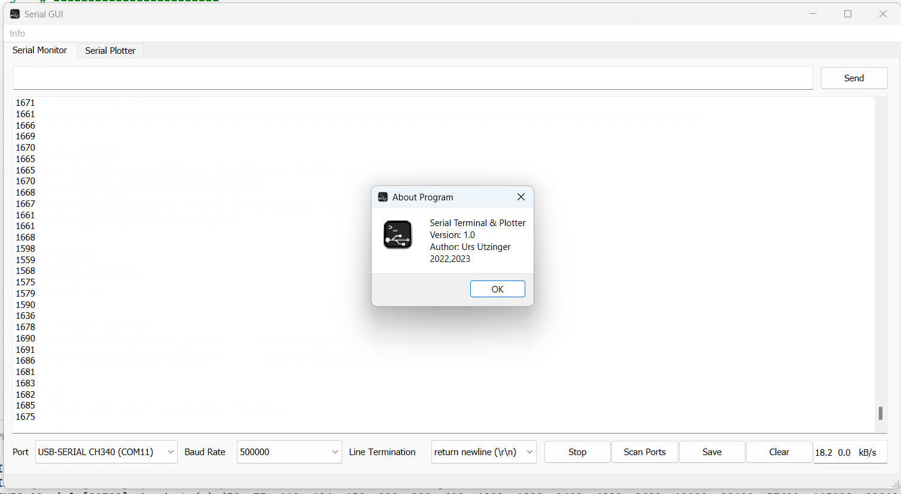
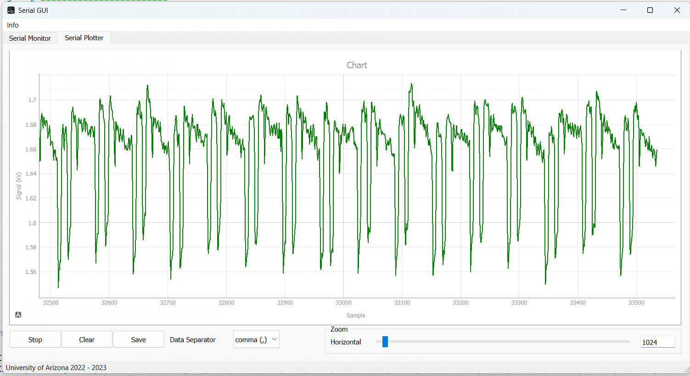

# Graphical User Interface for Serial Communication


## Description
Serial interface to send and receive text from the serial port similar to the Arduino IDE.

It includes a serial plotter to display numbers. Up to 4 numbers can be extracted from a received line of text and displayed as traces.
One can zoom, save and clear this display. Individual lines of text are identified through a selection of end of line characters.

This framework visualize signals and text at high data rates. QT is used to signal and time the application. Serial data handling occurs in its own thread.

Urs Utzinger
2022, 2023




## Installation
- pip3 install PyQT
- pip3 install numpy
- pip3 install pyserial
- pip3 install markdown

The main program is ```main_window.py```. It depends on the files in the ```assets``` and ```helper``` folder.

## How to use this program

### Receiving data

- open the Serial Monitor tab
- select serial port or plug in your device and hit scan ports
- select the baud rate
- select the line termination
- start the reception and display by hitting start
- you can save and clear the current content of the test display window

### Sending data

- complete receiving data section above
- enter text in the line edit box
- transmit it with enter or hit send button
- recall previous lines of text with up and down arrow

### Plotting data

- complete the receiving data section above
- open the Serial Plotter tab
- select data separator
- hit start
- adjust view with horizontal slider
- you can save and clear the currently plotted data

## Modules

### User Interface

The user interface is ``mainWindow.ui``` in the assets folder and was designed with QT Designer.

### Main

The main program loads the user interface and adjust its size to specified with and height compensating for scaling issues with high resolution screens. All QT signal connections to slots are created in the main program. It spawns a new thread for the serial interface handling (python remains a single core application though). Plotting occurs in the main thread as it interacts with the user interface.

### Serial Helper

The serial helper contains three classes. *QSerialUI* handles the interaction between the user interface and *QSerial*. It remains in the main thread and emits signals to which QSerial subscribes. QSerial runs on its own thread and sends data to QSerialUI with signals. *PSerial* interfaces with the pySerial module. It provides a unified interface to the serial port or the textIOWrapper around the serial port.

The serial helpers allow to open, close and change serial port by specifying the baud rate and port. They allow reading and sending byte arrays, a line of text or multiple lines of text. Selecting text encoding and end of line characters handling is implemented using textIOWrapper. Data is collated so that we can process several
lines of text at once and take advantage of numpy arrays and need less frequent updates of the text display window.

The serial helpers uses 3 continuous timers. One to periodically check for new data on the receiver line. Once new data is arriving the timer interval is reduced to adjust for enable continuous high throughput. A second timer that emits throughput data (amount of characters received and transmitted) once a second. These 2 timers are setup after QSerial is moved to its own thread. A third timer trims the received text displayed in the display window once every 10 seconds to not exceed a pre defined amount.

The challenges in this code is how to run a driver in a separate thread and how to collate text so that processing and visualization can occur with high data rates. Using multithreading in pyQT does not release the Global Interpreter Lock and therefore might not result in performance increase or increased GUI responsiveness.

### Plotter Helper

The plotter helper extracts numbers from lines of text and appends them to a numpy array. The data array is organized in a circular buffer. The maximum size of that data array is predetermined. A signal trace is a column in the data array and the number of columns is adjusted depending on the numbers present in the line of text but it can not exceed MAX_COLUMNS (4).

The plotter helper provides a plotting interface using pyqtgraph. Data is plotted where the newest data is added on the right (chart) and the amount of data shown is selected through an adjustable slider. Vertical axis is auto scaled based on the data available in the buffer.

A timer is used to update the chart 10 times per second. Faster updating is not necessary as visual perception is not improved.

Plotting occurs in the main thread as it needs to interact with the Graphical User Interface.
