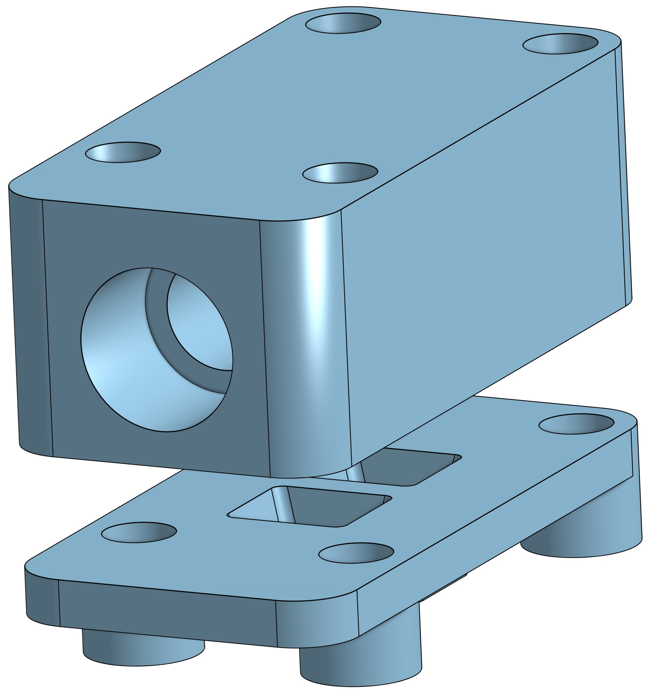
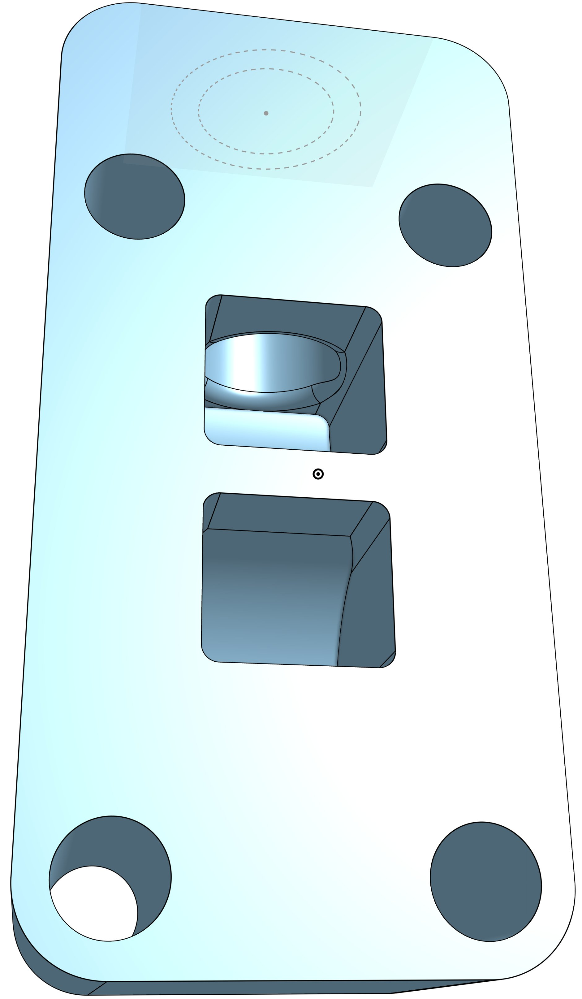
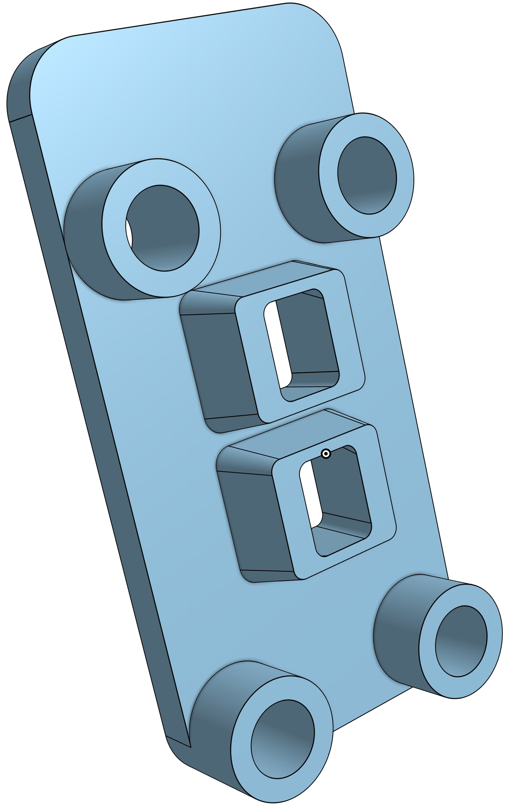

# MediBrick

A cost-effective Solution for Biomedical Measurements

## Problem Description

Biomedical engineering students need to practice measuring signals from living systems.
Measurement equipment is needed for classroom laboratories that can safely record common physiological parameters.
For a wide adoption, such equipment should be cost effective and repairable in-house.
Therefore, it should take advantage of existing components that are open source and distributed through domestic channels.
While there are commercial systems available [^fn1] [^fn2], there is no unifying approach that takes advantage of existing third party hardware, gives option to expand functionality at later time and uses open source software.  Such measurement modules could also be readily incorporated into academic research projects.

[^fn1]: Bioradio, https://staging.glneurotech.com/product-category/bioradio-all
[^fn2]: Protocentral https://protocentral.com

Need Statement: **An expandable, low-costs, open-design system is needed that measures physiological parameters in a class room setting in a safe manner.**

## Project Goals
- We strive to create an educational system to measure physiological signals.
- It shall be easily manufactured at an educational institution.
- It shall record, display and store common physiological measurements safely in a class room setting.

## Measurement Solutions
This project currently consists of the following measurement solultions:

| ECG and Impedance | Electronic Stethoscope and Blood Pressure | Pulse Oximeter | Temperature | Intertial Measurement Unit | Air Quality | Lung Capacity |
| --- | --- | --- | --- | --- | --- | --- |
|  |  |  |  |  |  | N.A. |
|  |  |  |  |  |  | N.A. |

- **General Physiology Background**
    - [Cardiac Physiology](cardiac_physiology.md) &#128214;
- **Electro Cardiogram Solutions**
    - [ECG Measurement](ecg_measurements.md) &#128214;
    - [ECG Solutions](ecg_solutions.md) &#10004;
    - [ECG MediBrick v1](ECG_Board\README.md)
    - [ECG MediBrick v2](Impedance_Potential_Board\README.md) &#128194;&#128736;
- **Bio Impedance Solutions**
    - [Impedance Measurement](impedance_measurements.md) &#128214;
    - [Impedance Solutions](impedance_solutions.md) &#10004;
    - [Impedance MediBrick v1](Impedance_Board/README.md)
    - [Impedance MediBrick v2](Impedance_Potential_Board\README.md) &#128194;&#128736;
- **Temperature and Strain Gauges**
    - [Temperature Measurement](temperature_measurements.md) &#128214;
    - [Temperature MediBrick](Thermistor_Board/README.md) &#128194; &#128736;
- **Stethoscope and Sound**
    - [Sound Measurement](sound_measurement.md)&#128214;
    - [Pressure Measurement](pressure_measurement.md) &#128214;
    - [Sound Solutions](sound_solutions.md) Sound Recording Solutions &#10004;
    - [Pressure Solutions](pressure_solutions.md) Pressure Recording Solutions &#10004;
    - [Stethoscope MediBrick V1](Stethoscope_with_3rdparty_Sound\README.md) PCB Artist I2S codec interfacing with ESP
    - [Stethoscope with Blood Pressure MediBrick V2](Stethoscope_with_Pressure\README.md) &#128194;&#128736;
- **Pulse Oximeter**
    - [SpO2 Measurement](spo2_measurements.md)&#128214;
    - [SpO2 Solutions](spo2_solutions.md) &#10004;
    - [SpO2 MediBrick]() &#128194;
- **Air Quality**
    - [Airquality Measurement](airquality_measurement.md)&#128214;
    - [Airquality Solutions](airquality_solutions.md) &#10004;
    - [Airwqality MediBrick](Airquality/README.md) &#128194;&#128736;
- **Acceleration, Gyration, Compass and Pressure Solution**
    - [Acticity Measurements with Inertial Measurement Unit](imu_measurements.md)&#128214;
    - [Inertial Measurement Unit Solutions](imu_solutions.md) &#10004;
    - [IMU MediBrick](IMU_Board/README.md)&#128194;&#128736;

- **Enclosures**
    - [Brick Top](https://cad.onshape.com/documents/be6b7e5f847d89f3ec5eb9d5/w/761fee9865ca7ef709028476/e/ff897b4f359cec83b782ff14)
    - [Brick Bottom](https://cad.onshape.com/documents/92ad78475e8f0b17ff5e260b/w/88a02abbcb12cdbd4d9de3ad/e/fb79ca58ad2b6a0298e9d1b6)
    - [Brick Assembly](https://cad.onshape.com/documents/11cbfe9c3c739b6e8ecbf3d7/w/989b564ecd7f6d069e643ac0/e/85542f706be8cc7554218e8d)
    - Face Plates: [IMU](https://cad.onshape.com/documents/eb58e78174fdb2053487973b/w/903e17c4126fb90e8782ab92/e/f4b50a954b0de64bf397a15c), [Environment](https://cad.onshape.com/documents/6f9a87cae125641fc3a0651c/w/6e25f32c6ac446efd4e51be7/e/7a2fa3c5e053c8442ada89bd), [SpO2](https://cad.onshape.com/documents/bcb286d5b9de6189ba796e00/w/0a567208a5b563fc8cacc531/e/c605a2f5695bfb70bc8e7631), [Temperature](https://cad.onshape.com/documents/dac7e67c5b0270015712d245/w/d60526c34fb0e9aab2c02a4b/e/a363f2f519f137cd253c6eda), [BioZ](https://cad.onshape.com/documents/4b23bdc1fe41aa5490b46d9c/w/fd4737f6a1ca7fbcd3b1d7f7/e/89122d5ddac798ebf451ad60), [Stethoscope ](https://cad.onshape.com/documents/06546d5c2b6ecb0931149c5d/w/2aa54258cb58c3e795c7fea9/e/823e2851771a01788a8faacf)
    - Receiver Top
    - Receiver Bottom
    - Charging Station
    - [Stethoscope Microphone Bottom](https://cad.onshape.com/documents/f23280f0a46d3d6c755669df/w/b75e085438cd92ba1b26b647/e/00c40c7437b1518e003bac9d)
    - [Stethoscope Microphone Top](https://cad.onshape.com/documents/ef2b037c38f1baa1c0b23c04/w/556b341c46d5852ab7c96559/e/758f32969c2d9c1e8976b746)
    - [Stethsocope Microphone Assembly](https://cad.onshape.com/documents/d283f9d6f3aaa55053af4362/w/49cecc8fd4c274541d804894/e/971484d9434ce01aa62acc7a)

## Microcontroller and Software

- [Software and Programming](microcontroller_programming.md) 
- [Microntrolloer Options](microcontroller_solutions.md)

## Hardware

### Design and Manufacturing 

- [Mechanical Design](mechanical_design_and_manufacturing.md) Approach to convert the mechanical models to 3D printing instructions.
- [PCB Design (Eagle CAD)](electronic_design.md)
- [PCB manufacturing](pcbmanufacturing.md) Our appriach to create populated PCBs.

### Brick
| Brick | Top | Bottom |
| ------- | ------ |  ------ |
|   |  |  |

### Receiver

### Charging Station

### Supplemental Parts
| Mic Adapter | Top | Bottom |
| ------- | ------ |  ------ |
|  |  |  | 

## Project Status

| Brick | Mechanical CAD | Electrical CAD|  Assembled | Test Software | Production Software
| ------- | ------ |  ------ | ------ | ------ | ------ |
| **Temperature**     | Completed | Completed | Completed | Completed | Working on |
| **SpO2** | Completed | Completed | Completed | Completed| Working on
| **Stethoscope**     | Completed | Fixing I2C errors | Pressure incomplete| Sound Completed | Working on
| **Environment**     | Completed | Completed| Completed | MICS sensor incomplete| Working on
| **IMU**             | Completed | Completed | Completed | Completed | Working on
| **Bio Potential and BIOZ** | Completed | Completed | Completed | Driver working on | Not started yet
| Protoype Sound w third arty ES8388 | Completed | Completed | Comleted | Completed | |  
| Impedance w AD 5933 network analyzer | Completed | Completed | Completed | Incomplete | |
| ECG w Sparkfun Breakout | Completed | Completed | Completed | Completed |  |
| Thermistor/Strain Gauge board using LTC2473 | Completed | Completed | Completed | Completed| |

Urs Utzinger, 10/2024