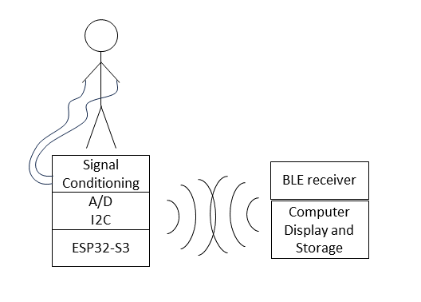
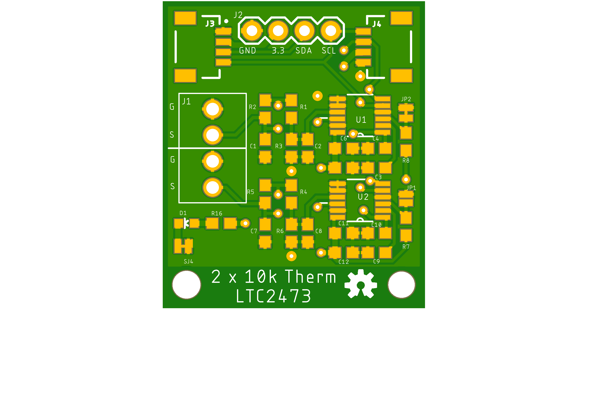

# Biomedical Sensor Board

- We strive to create an educational system to measure physiological signals. 
- It shall be easily reproducable at an educational institution.
- It shall record, display and store common physiological measurements safely in a class room setting.

## Problem Description

Biomedical engineering students need to practice measuring signals from living systems.
Measurement equipment is needed for classroom laboratories that can safely record common physiological signals.
For a wide adoption, such equipment should be cost effective and repairable in-house. 
Therefore it should take adavange of existing components that are open source and distributed through domestic channels.
While there are commercial systems available [^1][^2], there is no unifying approach that takes advantage of existing third party hardware, gives option to expand functionality at later time and uses open source software. If there were well documented inexpensive measuremetn modules they could also be incorporated into academic research projects.

[^1]: Bioradio, https://staging.glneurotech.com/product-category/bioradio-all
[^2]: Protocentral https://protocentral.com

## Need Statement

An expandable, low-costs, open-design system is needed that measures physiological paramters in a class room setting in a safe manner.

## Sensor Systems

- [ECG](ECG.md) Electro Cardiogram Solutions
- [Impedance](impedance.md) Bio Impedence Solutions
- [Temperature](temperature.md) Temperature and Strain Gauges Solutions
- [Sound](sound.md) Sound Recording Solutions
- [Pressure](pressure.md) Pressure Sensors Solutions
- [SpO2](spo2.md) Pulse Oximeter Solutions
- [Micro Controller](microcontroller.md) Micro Controller Solutions
- [PCB manufacturing](pcbmanufacturing.md) Approach to create your own populated PCBs

## Boards

Currently the following boards have been designed:

- Thermistor board using two LTC2473 for precision differential analog to digital conversion at up to 800 samples per second, equipmed with QWIIC connectors to connect them to a microcontroller.
- The same board can also be used to measure strain gauges.

