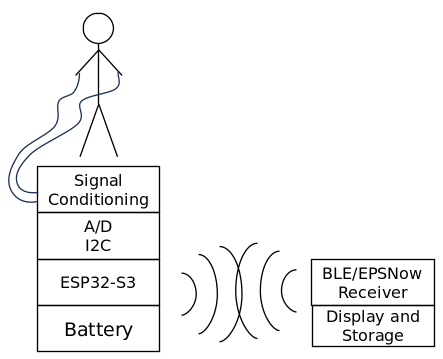

# Medibrick 2000

- We strive to create an educational system to measure physiological signals.
- It shall be easily reproducible at an educational institution.
- It shall record, display and store common physiological measurements safely in a class room setting.

## Problem Description

Biomedical engineering students need to practice measuring signals from living systems.
Measurement equipment is needed for classroom laboratories that can safely record common physiological signals.
For a wide adoption, such equipment should be cost effective and repairable in-house.
Therefore, it should take advantage of existing components that are open source and distributed through domestic channels.
While there are commercial systems available [^fn1] [^fn2], there is no unifying approach that takes advantage of existing third party hardware, gives option to expand functionality at later time and uses open source software. 

If there were well documented inexpensive measurement modules, they could also be readily incorporated into academic research projects.

[^fn1]: Bioradio, https://staging.glneurotech.com/product-category/bioradio-all
[^fn2]: Protocentral https://protocentral.com

## Need Statement

An expandable, low-costs, open-design system is needed that measures physiological parameters in a class room setting in a safe manner.

## Sensor Systems

### Common Physiologic Paramters

**Biopotentials** are created by electric fields due to ion gradients primarily over muscle cells and neurons. Skin resistance is attenuating the measurable signal, requiring electrical amplification.

**Bioimpedance** measures body and tissue impedance by injecting oscillating current through electrodes and measuring the resulting voltage. The frequency response is indicative of electrical tissue composition.

**Optical Absorption** is measured with light passing through the body and tissue at different optical wavelengths extracting optical absorption properties of tissue constituents such as hemoglobin. Variation in concentration occurs during blood pressure propagation. Background such as melanin and scattering affect these readings and can reduce signal strength. When measuring with more than two wavelenghts, additional Hemoglibin species can be detected however most common sensor elements support two wavelenghts.

**Temperature** is a simple measurement for increased metabolism which can be caused through viral or bacterial load as a defense mechanism to lower viral replication but also due to hyperactivity of cancer or exercise.

**Sound** is emitted as a result of mechanical activity such as heart deformation during muscle contraction, closure of valves or blood turbulence causing pressure gradients, abdominal muscle contractions, and airflow resulting in pressure wave propagation through the body.

### IC Manufactureres for Bio Analog Front Ends (AFE)
Below are two companies manfacturing integreated bio front ends.

1) [Analog Devices](https://ez.analog.com/webinar/m/presentations/2742) overview of all their Bio Front Ends.
2) [Texas Instruments](https://www.ti.com/data-converters/integrated-special-function/medical-afes/biosensing-afes/overview.html) over of all their Bio Front Ends.

Below are the commonly measured signals using electronic analog front ends. In general, physiologic signals are slow with low frequency content compared to other electric signals but weak and needing significant amplification and suppression of background.

- Biopotentials
    - Electro Cardio Gram (ECG) heart muscle acticity
    - Electro Mio Gram (EMG) any muscle activity
    - Electro Occulo Gram (EOG) eye movement
    - Electro Encephalo Gram (EEG) brain neural activity

- Bioimpedance
    - Whole Body Impedance Analysis (BIA) or Total Body Composition (TBC)
    - Segmental Body Impedance (smaller regions of the body).
        - Respiratory Rate (RR)
        - Lung Composition (LC)
        - Pulmonary Edema (PE)
    - Galvanic skin response (GSR), Skin Conductance Level (SCL) or Electro dermal activity (EDA)as a result of physiologic arousal

- Optical Plethysmo Graphy
    - Pulse Plethysmo Graphy (PPG), detecting pressure waves passing beneath the sensor, non contact heart rate and pulse propagation
    - Blood Oxygenation
    - $SPO_2$ Pulse Oximetery, oxygen saturation

- Temperature
    - External skin temperature
    - Internal temperature

- Sound
    - Heart sounds (S1, S2)
    - Blood vessel sounds induced by blood pressure cuff, als know as Korotkoff sounds
    - Lung sounds
    - Bowel sounds

- Environment
    - Acceleration, Gyration, Mangnetic field
    - Humidity, Temperature
    - Pressure
    - Light level
    - $CO_2$ concnetration
    - Particulate matter concentration
    - Presence of Volatile Organize Compounts
    - Presence of Carbion Monoxide

### Sensor Board Solutions
In this project we developed measurement board for the following categories:

- [Potential ECG](ecg.md) Electro Cardiogram Solutions
- [Impedance](impedance.md) Bio Impedance Solutions
- [Impedance & Potential](MAX30001G.md) Combined ECG, Impedance and Galvanic Skin Response
- [Temperature](temperature.md) Temperature and Strain Gauges Solutions
- [Sound](sound.md) Sound Recording Solutions
- [Sound ES8388](ES8388_audio_board.md) PCB Artist I2S codec interfacing with ESP
- [Pressure](pressure.md) Pressure Sensors Solutions
- [SpO2](spo2.md) Pulse Oximeter Solutions
- [Airquality](airquality.md) Pulse Oximeter Solutions
- [Inetrial Measurement Unit](imu.md) Acceleration, Gyration, Compass and Pressure Solution

We used the following micro controllers and manufacturing techniques:

- [Micro Controller](microcontroller.md) Micro Controller Solutions
- [PCB manufacturing](pcbmanufacturing.md) Approach to create our own populated PCBs

## Enclosure and Packaging
To be written

## Project Status

Currently the following boards have been designed:

- Thermistor board using LTC2473 for precision differential analog to digital conversion at up to 800 samples per second, equipped with QWIIC connectors to connect them to a micro controller. The same board can also be used to measure strain gauges.
- Thermistor board using microcontroller's internal A/D converter
- ECG board using Sparkfun ECG analog front end
- $SPO_2$ board using TI AFE4400
- Impedance board using AD 5933 network analyzer
- Impedance and Potential board using MAX30001G
- Sound board using ES8388 codec and TI OPA344 and PUI AMM7472 microphone
- Air Qualtiy board
- IMU board
