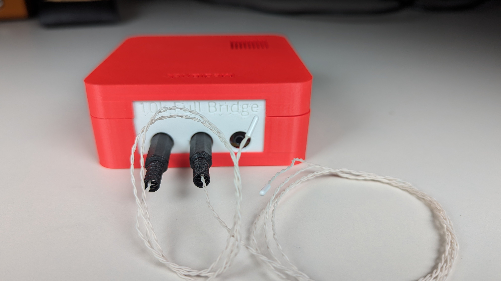
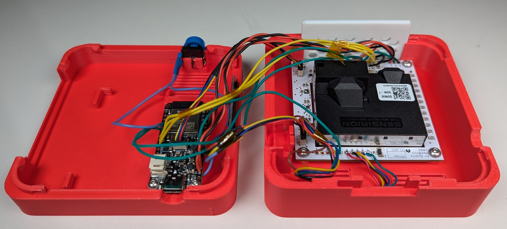

# MediBrick

A cost-effective Solution for Biomedical Measurements.

Urs Utzinger, 10/2024 and capstone teams: 24052 (2023/24), 23094 (2022/23).
Biomedical Engineering Department, The University of Arizona.

 
Table of Content:
<!-- TOC start (generated with https://github.com/derlin/bitdowntoc) -->

- [MediBrick](#medibrick)
   * [Problem Description](#problem-description)
   * [Project Goals](#project-goals)
   * [Measurement Solutions](#measurement-solutions)
   * [Microcontroller and Software](#microcontroller-and-software)
   * [Hardware](#hardware)
      + [Design and Manufacturing ](#design-and-manufacturing)
      + [Enclosures](#enclosures)
   * [Project Status](#project-status)

<!-- TOC end -->

<!-- TOC -->

Posters and Papers: 
- *Open source platform to measure physiological signals in a classroom setting*, BMES 2024 Annual Meeting: Biomedical Engineering Education - Poster Session C, Poster Q15 

## Problem Description

Biomedical engineering students need to practice measuring signals from living systems.
Measurement equipment is needed for classroom laboratories that can safely record common physiological parameters.
For a wide adoption, such equipment should be cost effective and repairable in-house.
Therefore, it should take advantage of existing components that are open source and distributed through domestic channels.
While there are commercial systems available [^fn1] [^fn2], there is no unifying approach that takes advantage of existing third party hardware, gives option to expand functionality at later time and uses open source software.  Such measurement modules could also be readily incorporated into academic research projects.

[^fn1]: Bioradio, https://staging.glneurotech.com/product-category/bioradio-all
[^fn2]: Protocentral https://protocentral.com

**An expandable, low-costs, open-design system is needed that measures physiological parameters in a class room setting in a safe manner.**

## Project Goals
- We strive to create an educational system to measure physiological signals.
- It shall be easily manufactured at an educational institution.
- It shall record, display and store common physiological measurements safely in a class room setting.

## Measurement Solutions
This project consists of the following measurement solutions:

| ECG and Impedance | Electronic Stethoscope and Blood Pressure | Pulse Oximeter | Temperature | Inertial Measurement Unit | Air Quality | Lung Capacity |
| --- | --- | --- | --- | --- | --- | --- |
|  |  |  |  |  |  | N.A. |
|  |  |  |  |  |  | N.A. |

These are the relevant project files. 

Education Content: &#128214;, Sources used to find a solution: &#10004;, Solution: &#128194;, Assembly Instructions: &#128736;, Software: &#128200;

- **General Physiology Background**
    - [Cardiac Physiology](cardiac_physiology.md) &#128214;
    - [Common Physiologic Measurements](physiologic_measurements.md) &#128214;
- **Electro Cardiogram Solutions**
    - [ECG Measurement](ecg_measurements.md) &#128214;
    - [ECG Solutions](ecg_solutions.md) &#10004;
    - [ECG MediBrick v1](ECG_Board/README.md)
    - [ECG MediBrick v2](Impedance_Potential_Board/README.md) based on MAX30001G &#128194;
        - [Assembly Instructions](Impedance_Potential_Board/assembly.md) &#128736;
- **Bio Impedance Solutions**
    - [Impedance Measurement](impedance_measurements.md) &#128214;
    - [Impedance Solutions](impedance_solutions.md) &#10004;
    - [Impedance MediBrick v1](Impedance_Board/README.md) based on AD5933
    - [Impedance MediBrick v2](Impedance_Potential_Board/README.md) based on MAX30001G &#128194;
        - [Assembly Instructions](Impedance_Potential_Board/assembly.md) &#128736;
- **Stethoscope and Sound**
    - [Sound Measurement](sound_measurement.md)&#128214;
    - [Pressure Measurement](pressure_measurements.md) &#128214;
    - [Sound Solutions](sound_solutions.md) Sound Recording Solutions &#10004;
    - [Pressure Solutions](pressure_solutions.md) Pressure Recording Solutions &#10004;
    - [Stethoscope MediBrick V1](Stethoscope_with_3rdparty_Sound/README.md) PCB Artist I2S codec interfacing with ESP
    - [Stethoscope with Blood Pressure MediBrick V2](Stethoscope_with_Pressure/README.md) &#128194;
        - [Assembly Instructions](Stethoscope_with_Pressure/assembly.md) &#128736;
- **Pulse Oximeter**
    - [SpO2 Measurement](spo2_measurements.md) &#128214;
    - [SpO2 Solutions](spo2_solutions.md) &#10004;
    - [SpO2 MediBrick](SPO2_Board/README.md) &#128194;
        - [Assembly Instructions](SPO2_Board/assembly.md) &#128736;
- **Temperature and Strain Gauges**
    - [Temperature Measurement](temperature_measurements.md) &#128214;
    - [Temperature Solutions](temperature_solutions.md) &#10004;
    - [Temperature MediBrick](Thermistor_Board/README.md) &#128194;
        - [Assembly Instructions](Thermistor_Board/assembly.md) &#128736;
- **Acceleration, Gyration, Compass and Pressure Solution**
    - [Activity Measurements with Inertial Measurement Unit](imu_measurements.md)&#128214;
    - [Inertial Measurement Unit Solutions](imu_solutions.md) &#10004;
    - [IMU MediBrick](IMU_Board/README.md)&#128194;
        - [Assembly Instructions](IMU_Board/assembly.md) &#128736;
    - IMU MediBrick v2. Not available yet, but should include Real Time Kinematic GPS such as [ZED-F9P](https://www.u-blox.com/en/product/zed-f9p-module)
- **Air Quality**
    - [Airquality Measurement](airquality_measurements.md)&#128214;
    - [Airquality Solutions](airquality_solutions.md) &#10004;
    - [Airwqality MediBrick](Airquality/README.md) &#128194;
        - [Assembly Instructions](Airquality/assembly.md) &#128736;
- **Lung Capacity**
    - Not available yet, will be based on Sensirion [SFM3304-D](https://sensirion.com/products/catalog/SFM3304-D)

## Microcontroller and Software

- [Software and Programming](microcontroller_programming.md) 
- [Microcontroller Options](microcontroller_solutions.md)

To visualize data I recommend [SerialUI](https://github.com/uutzinger/SerialUI) &#128200;

## Hardware

### Design and Manufacturing 

- [Mechanical Parts Manufacturing](mechanical_design_and_manufacturing.md) Approach to convert the mechanical models to 3D printing instructions.
- [PCB Design](electronic_design.md) Settings for Eagle CAD.
- [PCB Manufacturing](pcb_manufacturing.md) Settings for PCBWay,

### Enclosures
| Assembly| Top | Bottom |
| ------- | ------ |  ------ |
|  |  |  |

Receiver

Charging Station

## Project Status

| Brick | Mechanical CAD | Electrical CAD|  Assembled | Test Software | Production Software
| ------- | ------ |  ------ | ------ | ------ | ------ |
| **Temperature**     | Completed | Completed | Completed | Completed | Working on |
| **SpO2** | Completed | Completed | Completed | Completed| Working on
| **Stethoscope**     | Completed | Testing   | Testing   | Sound Optimizing, Pressure Testing | Working on
| **Air Quality**     | Completed | Completed| Completed | MICS sensor support missing | Working on
| **IMU**             | Completed | Completed | Completed | Completed | Working on
| **Bio Potential and BIOZ** | Completed | Untested | Untested | Driver incomplete | Working on
| Protoype Sound w third arty ES8388 | Completed | Completed | Completed | Completed | N.A. |  
| Impedance w AD 5933 network analyzer | Completed | Optimization | Testing| Incomplete | N.A.|
| ECG w Sparkfun Breakout | Completed | Completed | Completed | Completed | N.A. |
| Thermistor/Strain Gauge board using LTC2473 | Completed | Completed | Completed | Completed | N.A. |

