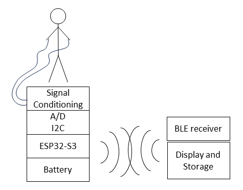

# Biomedical Sensor Board

- We strive to create an educational measruement system for physiological signal. 
- It shall be easily reproducable at an educational institution.
- It shall record, display and storage common physiological measurements safely in a class room setting.

## Problem Description

Biomedical engineering undergradute students need to practice measuring signals from living systems.
Measurement equipment is needed for classroom laboratories that can safely record common physiological signals.
For a wide adoption, such equipment should be cost effective and repairable in house. 
Therefore it should take adavange of existing components that are open source and distributed though dometic channels.
While there are commercial systems available, there is no unified approach that takes advantage of existing hardware and software and fills in the gap for components that are either expensive or incompatible.
This project strives to create a paltform that can be easily expanded, uses open source software and open hardware designs to create measruement modules that can be used in a modular fashion.
Since students using these sytems will learn the measurent principles and how to analyze the data it records, it is likely these system will also be used in research projects.

## Need Statement

An expandable, low-costs, open-design system is needed that measures physiological paramters in a class room as well as research setting in a safe manner.

## Sensor Systems

- [ECG](ECG.md) Electro Cardiogram Solutions
- [Impedance](impedance.md) Bio Impedence Solutions
- [Temperature](temperature.md) Temperature and Strain Gauges Solutions
- [Sound](sound.md) Sound Recording Solutions
- [Pressure](pressure.md) Pressure Sensors Solutions
- [SPO2](spo2.md) Pulse Oximeter Solutions
- [Micro Controller](microcontroller.md) Micro Controller Solutions
- [PCB manufacturing](pcbmanufacturing.md) Approach to create your own populated PCBs

## Boards

Currently the following boards have been designed:
- Thermistor board using two LTC2473 for precision differential analog to digital conversion at up to 800 samples per second, connected with QWIIC connectors to a microcontroller

