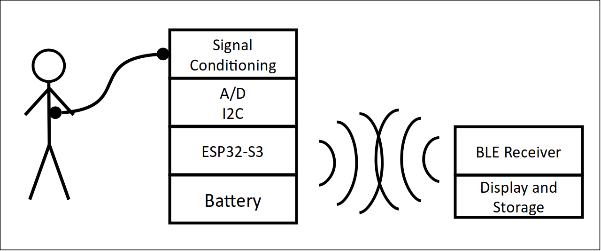

# MediBrick

- We strive to create an educational system to measure physiological signals.
- It shall be easily reproducible at an educational institution.
- It shall record, display and store common physiological measurements safely in a class room setting.

## Problem Description

Biomedical engineering students need to practice measuring signals from living systems.
Measurement equipment is needed for classroom laboratories that can safely record common physiological parameters.
For a wide adoption, such equipment should be cost effective and repairable in-house.
Therefore, it should take advantage of existing components that are open source and distributed through domestic channels.
While there are commercial systems available [^fn1] [^fn2], there is no unifying approach that takes advantage of existing third party hardware, gives option to expand functionality at later time and uses open source software. 

If there were well documented, inexpensive measurement modules, they could also be readily incorporated into academic research projects.

[^fn1]: Bioradio, https://staging.glneurotech.com/product-category/bioradio-all
[^fn2]: Protocentral https://protocentral.com

## Need Statement

An expandable, low-costs, open-design system is needed that measures physiological parameters in a class room setting in a safe manner.

## Sensor Systems

Bio Analog Front Ends (AFE) have a high level of integration and are used when possible. Analog Devices and Maxim as well as Texas Instruments manufacture such AFEs.

Analog Devices overview of all their Bio Front Ends.
Texas Instruments over of all their Bio Front Ends.
The AFEs measure the singals listed below. In general, physiologic signals are slow with low frequency content compared to other electric signals but weak and needing significant amplification and suppression of background.

### Common Phyiologic Measurements

**Biopotentials** are created by electric fields due to ion gradients primarily over muscle cells and neurons. Skin resistance is attenuating the measurable signal requiring electrical amplification.

- Electro Cardio Gram (ECG); heart muscle acticity
- Electro Mio Gram (EMG); any muscle activity
- Electro Occulo Gram (EOG); eye movement
- Electro Encephalo Gram (EEG); brain neural activity

**Bioimpedance** measures body and tissue impedance by injecting oscillating current through electrodes and measuring the resulting voltage. The frequency response is indicative of electrical tissue composition.

- Whole Body Impedance Analysis (BIA) or Total Body Composition (TBC)
- Segmental Body Impedance (smaller regions of the body).
    - Respiratory Rate (RR)
    - Lung Composition (LC)
    - Pulmonary Edema (PE)
- Galvanic skin response (GSR), Skin Conductance Level (SCL) or Electro dermal activity (EDA)as a result of physiologic arousal

**Optical Absorption** is measured with light passing through the body and tissue at different optical wavelengths extracting optical absorption properties of tissue constituents such as hemoglobin. Variation in concentration occurs during blood pressure propagation. Background such as melanin and scattering affect these readings and can reduce signal strength. When measuring with more than two wavelenghts, additional Hemoglibin species can be detected, however most common sensor elements support two wavelenghts.

- Pulse Plethysmo Graphy (PPG); detecting pressure waves passing beneath the sensor, non contact heart rate and pulse propagation
- Blood Oxygenation
- $SPO_2$ Pulse Oximetery, oxygen saturation

**Temperature** is a simple measurement for increased metabolism which can be caused through viral or bacterial load as a defense mechanism to lower viral replication but also due to hyperactivity of cancer or exercise.

- External skin temperature
- Internal temperature

**Sound** is emitted as a result of mechanical activity such as heart deformation during muscle contraction, closure of valves or blood turbulence causing pressure gradients, abdominal muscle contractions, and airflow resulting in pressure wave propagation through the body.

- Heart sounds (S1, S2)
- Blood vessel sounds induced by blood pressure cuff, als know as Korotkoff sounds
- Lung sounds
- Bowel sounds

**Activity**

- Acceleration, Gyration, Mangnetic field
- Barometric Pressure
- GPS

**Respiration**

- Air Flow
- Humidity, Temperature
- Pressure
- Light level
- $CO_2$ concentration
- Particulate matter concentration
- Presence of Volatile Organize Compounts
- Presence of Carbion Monoxide

**Cellular Structure**

**Analyte Concentrations**

# Sensor Solutions
We developed the following solultions:

- [Potential ECG](ecg.md) Electro Cardiogram Solutions
- [Impedance](impedance.md) Bio Impedance Solutions
- [Impedance & Potential](MAX30001G.md) Combined ECG, Impedance and Galvanic Skin Response
- [Temperature](temperature.md) Temperature and Strain Gauges Solutions
- [Sound](sound.md) Sound Recording Solutions
- [Sound ES8388](ES8388_audio_board.md) PCB Artist I2S codec interfacing with ESP
- [Pressure](pressure.md) Pressure Sensors Solutions
- [SpO2](spo2.md) Pulse Oximeter Solutions
- [Airquality](airquality.md) Pulse Oximeter Solutions
- [Inertial Measurement Unit](imu.md) Acceleration, Gyration, Compass and Pressure Solution

Put Images here

## Micro-controllers and Manufacturing Techniques

We considered the following microcontrollers and emloyed the following manufacturing techniques:

- [Micro Controller](microcontroller.md) Programming and Options
- [PCB manufacturing](pcbmanufacturing.md) Our appriach to create populated PCBs
- [Mechanical Design and 3D printing](3Dprinting.md) Approach to convert the mechanical models to 3D printing instructions

## OnShape CAD Models
- [Brick Top](https://cad.onshape.com/documents/5771a0816900fd12aa2ba4f2/w/387be7e09136f1fec5311adb/e/18e94dd1ad8a0983591cdd9f)
- [Brick Bottom](https://cad.onshape.com/documents/1aa6b482eeab92aeed454246/w/ff77b38fbcbbca58607625e2/e/808c84513e7a48627605ce9b)
- Receiver Top
- Receiver Bottom
- Charging Station

Put Images Here

## Project Status

| Brick | Mechanical CAD | Electrical CAD|  Assembled | Test Software | Production Software
| ------- | ------ |  ------ | ------ | ------ | ------ |
| **Temperature** | Brick Plate needs update | Completed | Completed | Completed | Working on |
| **$SPO_2$** | Brick Plate needs update | Completed | Completed | Completed| Working on
| **Stethoscope** | Brick Plate needs update | Completed | Pressure incomplete| Sound Completed | Working on
| **Environment** | Brick Plate needs update | Completed| Completed | MICS sensor incomplete| Working on
| **IMU** | Brick Plate nedds update | Completed | Completed | Completed | Working on
| **Bio Potential and BIOZ** | Brick Plate needs update | Completed | Completed | Driver working on | Not started yet
| Protoype Sound w third arty ES8388 | Completed | Completed | Comleted | Completed | |  
| Impedance w AD 5933 network analyzer | Completed | Completed | Completed | Incomplete | |
| ECG w Sparkfun Breakout | Completed | Completed | Completed | Completed |  |
| Thermistor/Strain Gauge board using LTC2473 | Completed | Completed | Completed | Completed| |
