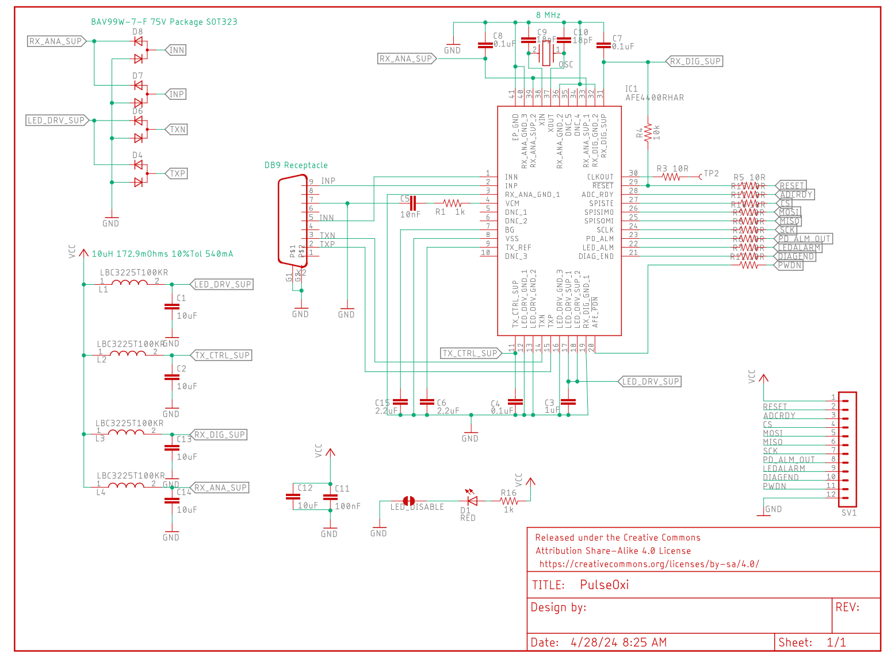
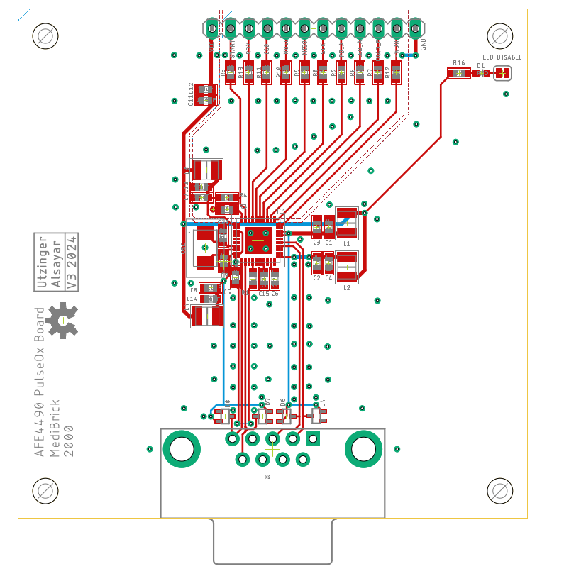

# Pulse Oximeter 

This pulesoximeter solution is based on Texas Instruments [AFE4490](datasheets/afe4490.pdf) This is a dual wavelelength pulseoximeter driver that interfaces DB9 connector based Nellcor OxiMax SpO2 Sensor.

## Assembly &#128736;

See separate [Assembly Instructions](assembly.md).

## Costs &#36;

| Item        | Quantity at Purchase | Costs  | Source            | Cost per Brick
|---                          | ---  | ---    | ---               | ---
| Microcontroller             |  1   | $17.5  | [Adafruit](https://www.adafruit.com/product/5477)          | $17.5
| Display                     |  5   | $13    | [Amazon](https://a.co/d/1QH0Ab9)            | $3
| Button                      | 25   | $9     | [Amazon](https://a.co/d/8KAuTwC) | $0.5 
| Battery                     |  1   | $10     | [Adafruit](https://www.adafruit.com/product/258)        | $10
| PCB                         |  5   | $45.20  | PCBWay            | $9
| Parts and Assembly          |  2   | $54*    | PCBWay            | $29
| DB9 Connector               |  1   | $2.40** | [Mouser](https://www.mouser.com/ProductDetail/TE-Connectivity-AMP/2301843-1?qs=rrS6PyfT74crws9wAQVNoA%3D%3D) | $2.40
| Nellcor OxiMax SpO2         |  1   | $14.30    | [Biometric Cables](https://www.biometriccables.in/collections/short-spo2-sensors/products/nellcor-oximax-compatible-short-spo2-sensor-adult) | $14.30
| Assorted Wires              |8m    | $15    | [Amazon](https://a.co/d/58djefc) | $1
| Assorted Screws and Nuts    |100   |  $7    | Amazon            | $0.05
| Assorted 3D printed parts   |      |        |                   | $3
|                             |      |        |                   |
| **Total**                   |      |        |                   | **$90**

*Electronic components without DB9 connecter are $12 per board. 

**The DB9 connector was soldered on manually. 

## Test Software &#128187;
Test software is located in the Arduino folder.

| Folder | Description | 
|--- |---|
|MediBrick_PulseOx_AFE44XX_Test | Comprehensive program that can change all device settings during runtime. |

## Microcontroller Software : &#9000;
Not finalized yet

## Electronics Design &#128268;

The following files are needed for PCB manufacturing and assembly.

- [Bill of Materials](PulseOxi_BOM.xlsx)
- [Manufacturing Files](PulseOxi_2024-05-09.zip)
- [Pick and Place](PulseOxi_PnP.xlsx)

The Bill of Materials is formatted so that its compatible with PCBWay submissions.

## 3D Printed Parts &#9881;
These are the links to the OnShape Design files, which you can edit and modify if you have an OnShape account (OnShape has free academic accounts).

- Medi Brick
  - [Brick Top](https://cad.onshape.com/documents/be6b7e5f847d89f3ec5eb9d5/w/761fee9865ca7ef709028476/e/ff897b4f359cec83b782ff14)
  - [Brick Bottom](https://cad.onshape.com/documents/92ad78475e8f0b17ff5e260b/w/88a02abbcb12cdbd4d9de3ad/e/fb79ca58ad2b6a0298e9d1b6)
  - [Brick Assembly](https://cad.onshape.com/documents/11cbfe9c3c739b6e8ecbf3d7/w/989b564ecd7f6d069e643ac0/e/85542f706be8cc7554218e8d)
  - [PulseOxi Brick Side Plate](https://cad.onshape.com/documents/bcb286d5b9de6189ba796e00/w/0a567208a5b563fc8cacc531/e/c605a2f5695bfb70bc8e7631)

