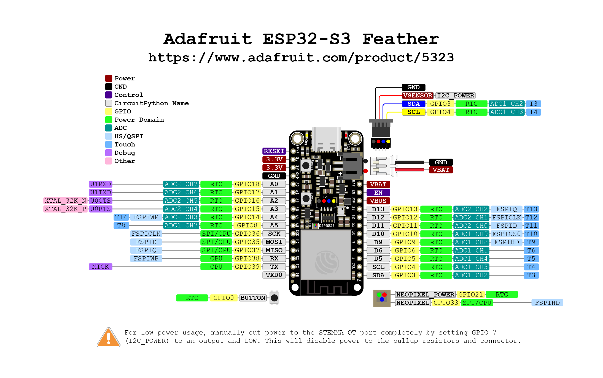

# Assembly of Stethoscope Brick

## Required Parts
- Fully Assembled Stethoscope PCB
- EPS Microcontroller, Adafruit Feather ESP32 S3 or Spakrfun Thing Plus C
- AWG 22 or AWG 24 Silicone Wire [e.g. Amazon](https://a.co/d/58djefc)
- Microphone Housing bottom part
- Microphone Housing top part
- Sensor Housing bottom part
- Sensor Housing top part
- Stainless Steel tubing, 7mm OD, 5mm ID
- Sensor Housing side plate
- Stethoscope [e.g.Amazon](https://a.co/d/7tQgoKs)
- Inflatable Arm cuff [Amazon $17](https://a.co/d/gKueGYV)
- Misc parts:
  - M3 screws 20mm and nuts for PCB mount
  - M3 screws  and nuts for PCB mount
  - Tubing and adapters

## Tubing
- Stethroscopee ID 5mm, barb 8mm
- Pressure cuff rubing ID 4mm, barb 7mm
- Rubber Tubing from Honeywell pressure sensor (ID 2mm ID OD 4mm OD), https://a.co/d/5GLJtFr
- Luer Lock 3/32 barbed adapter to rubber tubing from pressure sensor, https://a.co/d/hxruOyw
- Luer Lock 5/32 barbed adapter to pressure cuff tube, https://a.co/d/5GLJtFr

3/16, 1/8, 3/32 5/64

## Cost Break Down
- PCB
  - Assembly
  - PCB
  - Parts
  - Honeywell Pressure Sensor
- Stehoscope $25
- Arm Cuff $17
- Micro Controller
- 3D printed parts
- Assorted nuts and bolts

## 3D Printed Parts

### Microphone Housing
- [Top Part: OnShape CAD Model](https://cad.onshape.com/documents/ef2b037c38f1baa1c0b23c04/w/556b341c46d5852ab7c96559/e/758f32969c2d9c1e8976b746)
- [Bottom Part: OnShape CAD Model](https://cad.onshape.com/documents/f23280f0a46d3d6c755669df/w/b75e085438cd92ba1b26b647/e/00c40c7437b1518e003bac9d)

### Side Plate
- Not available yet

## Electronics

### Instructions

Attach color coded wires to the IO pads. E.g. red for power, black or green for ground and blue or white for digital input/output and yellow for analog wires. 

You can insert the wires into the holes (perpendicular) or or you can attach a short piece of the wires on top of the pad (perpendicular).

Suggested connecctions for the Sparkfun Thing Plus (USB-C) and the Adafruit Feather ESP32-S3 are given below.

#### Connections

PAD       | Function        | Thing Plus    | Feather
---       |---              |---            |---
**GND**   | Ground          | GND           | GND   
**3.3V**  | Power           | 3V3           | 3V3
**SDA**   | SDA / CDATA     | SDA  / GPIO21 | SDA  / GPIO3
**SCL**   | SCL / CCLK      | SCL  / GPIO22 | SCL  / GPIO4
**DOUT**  | Data Out        | POCI / GPIO19 | MISO / GPIO37
**LRCLK** | WS/Word Clock   | A5   / GPIO35 | A5   / GPIO8 / ADC1-CH7
**DIN**   | Data In / DSDIN | PICO / GPIO23 | MOSI / GPIO35
**SLCK**  | Bit Clock       | SCK  / GPIO18 | SCK  / GPIO36
**MCLK**  | Master Clock    | LED  / GPIO13 | A4   / GPIO14 / ADC2-CH3
**3.3V**  | Power           | 3V3           | 3V3

Require connections are in **bold**.

#### Pinouts

- [Thing Plus C Pinout](https://cdn.sparkfun.com/assets/3/9/5/f/e/SparkFun_Thing_Plus_ESP32_WROOM_C_graphical_datasheet2.pdf)
- [ESP32 S3 Pinout](https://learn.adafruit.com/assets/110811)

