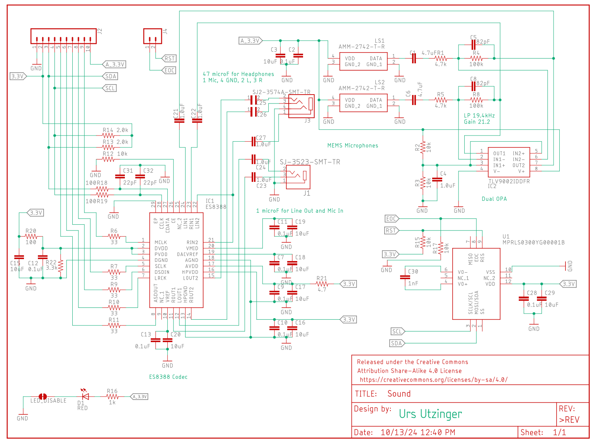
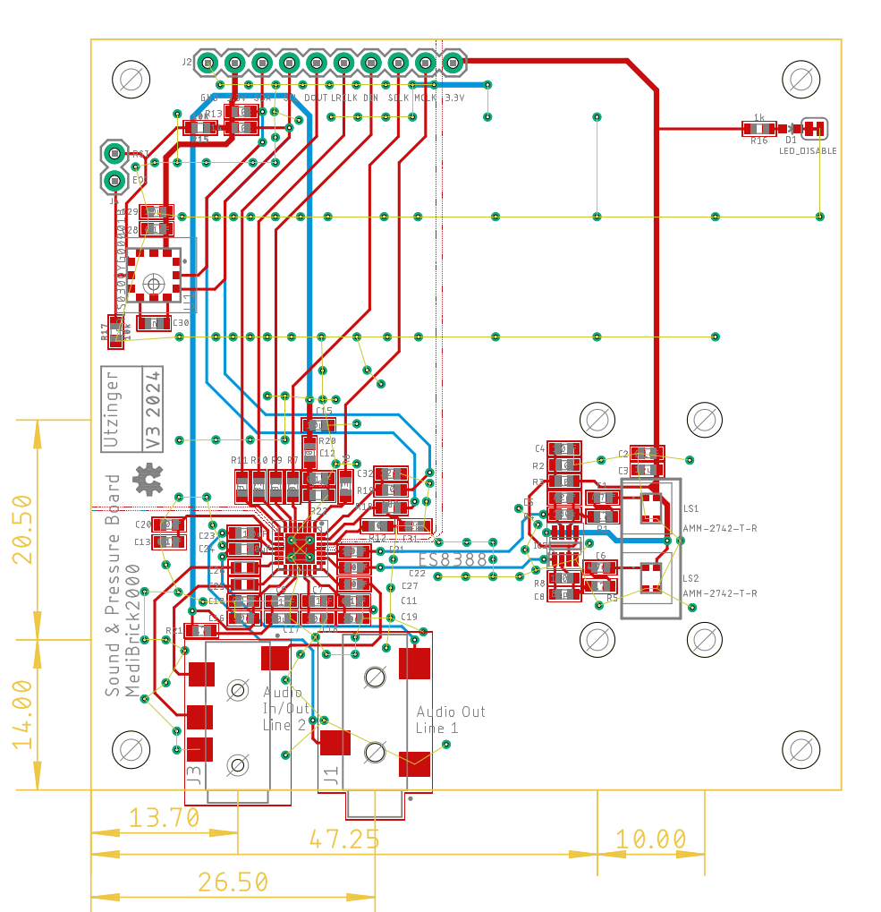
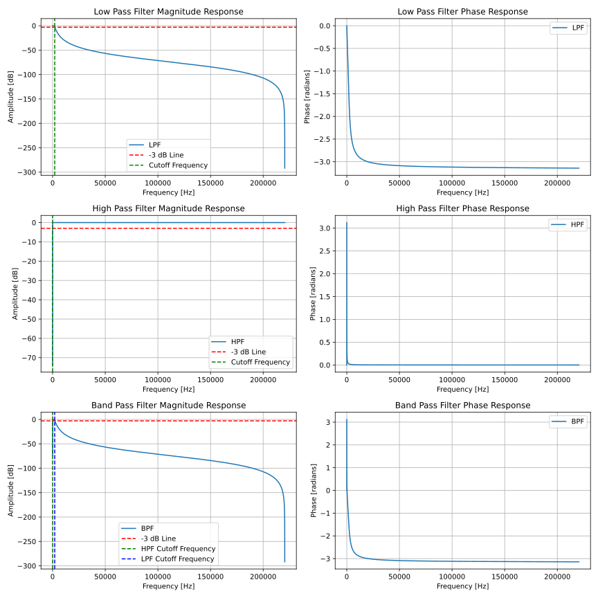

# Stethoscope with Pressure Sensor

This stethoscope pressure solution consists of a sound as well as pressure recorder. For sound the I2S (Inter-Integrated Circuit Sound) bus is used to communicate with the microcontroller. This interface allows streaming and recording audio to an audio codec board. The Everest Semiconductor [ES8388 audio codec](datasheets\ES8388.pdf) was chosen because its supported by Arduino Audio Tools and Arduino Audio Driver and because Espressif created the Lyrat Audio modules with published reference [designs](datasheets\esp32-lyrat-v4-schematic.pdf). Sound is recorded with pui audio analog MEMS microphones [AMM-2742](datasheets\Microphone-AMM-2742-T-R.pdf) that are mounted on the printed circuit board. Two microphones are used where one is connected to the stethoscope and the other recording the background. An [dual differential amplifier](datasheets\opa344.pdf) is used to low pass filter and amplify the signal from the microphone, however amplification would not be needed for the ES8388 codec. Pressure is measured with a Honeywell MPR pressure sensor [MPRLS0300YG](datasheets/MPR_Pressure_HWSC_S_A0016036563_1-3073392.pdf) that convers the physiological range of 0 to 200 mm Hg.  

## Costs &#36;

| Item        | Quantity at Purchase | Costs  | Source            | Cost per Brick
|---                          | ---  | ---    | ---               | ---
| Microcontroller             |  1   | $17.5  | [Adafruit](https://www.adafruit.com/product/5477)          | $17.5
| Display                     |  5   | $13    | [Amazon](https://a.co/d/1QH0Ab9)            | $3
| Button                      | 25   | $9     | [Amazon](https://a.co/d/8KAuTwC) | $0.5 
| Battery                     |  1   | $10     | [Adafruit](https://www.adafruit.com/product/258)        | $10
| PCB                         |  5   | $45.18 | PCBWay            | $9
| Parts and Assembly          |  2   | $56.55 | PCBWay            | $29
| MPRLS0300YG (pressure)      |  2   | $35    | Sager Electronics | $17.5
| Stethoscope                 |  1   | $25    | [Amazon](https://a.co/d/7tQgoKs) | $25
| Arm Cuff                    |  1   | $17    | [Amazon](https://a.co/d/gKueGYV) | $17
| Assorted Wires              |8m    | $15    | [Amazon](https://a.co/d/58djefc) | $1
| Assorted Screws and Nuts    |100   |  $7    | Amazon            | $0.05
| Silocone Tubing             |  1   |  $9    | [Amazon](https://a.co/d/5GLJtFr) | $2
| Luer Lock female 3/32 barb  | 10   |  $9    | [Amazon](https://a.co/d/hxruOyw) | $1
| Luer Lock male 5/32 barb    | 10   |  $8    | [Amazon](https://a.co/d/c4cmtBQ) | $1
| Stainless Steel Tubing      |250mm | $10    | Amazon            | $2
| Assorted 3D printed parts   |      |        |                   | $3
|                             |      |        |                   |
| **Total with blood pressure**     |      |        |                   | **$140**
| **Total without blood pressure**  |      |        |                   | **$100**

Electronic components excluding the pressure sensor are $14 per board.

The pressure sensor was mounted in house as the PCB assembly service did not have access to inexpensive source.

## Test Software &#128187;
Test software is located in the Arduino folder.

| Folder | Description | 
|--- |---|
|MediBrick_Stethoscope_ES8388_to_CSV | Prints the two channel audio signal to the serial port for visualization with SerialUI application|
| MediBrick_Stethoscope_ES8388_TestSound | Creates test tone in left and right channel for head phones
| MediBrick_Stethoscope_ES8388_to_Headphone | Plays the recorded sound to the headphone
| MediBrick_Stethoscope_PressureTest| Test the arm cuff pressure sensor

## Microcontroller Software : &#9000;
Not available yet.

## Electronics Design &#128268;

The following files are needed for PCB manufacturing and assembly.

- [Bill of Materials](Sound_BOM.xlsx)
- [Manufacturing Files](Sound_2024-10-16.zip)
- [Pick and Place](Sound_PnP.xlsx)

The Bill of Materials is formatted so that its compatible with PCBWay submissions.

## 3D Printed Parts &#9881;
These are the links to the OnShape Design files, which you can edit and modify if you have an OnShape account (OnShape has free academic accounts).

- Microphone Housing
  - [Stethoscope Microphone Bottom](https://cad.onshape.com/documents/f23280f0a46d3d6c755669df/w/b75e085438cd92ba1b26b647/e/00c40c7437b1518e003bac9d)
  - [Stethoscope Microphone Top](https://cad.onshape.com/documents/ef2b037c38f1baa1c0b23c04/w/556b341c46d5852ab7c96559/e/758f32969c2d9c1e8976b746)
  - [Stethsocope Microphone Assembly](https://cad.onshape.com/documents/d283f9d6f3aaa55053af4362/w/49cecc8fd4c274541d804894/e/971484d9434ce01aa62acc7a)

  

- Medi Brick
  - [Brick Top](https://cad.onshape.com/documents/be6b7e5f847d89f3ec5eb9d5/w/761fee9865ca7ef709028476/e/ff897b4f359cec83b782ff14)
  - [Brick Bottom](https://cad.onshape.com/documents/92ad78475e8f0b17ff5e260b/w/88a02abbcb12cdbd4d9de3ad/e/fb79ca58ad2b6a0298e9d1b6)
  - [Brick Assembly](https://cad.onshape.com/documents/11cbfe9c3c739b6e8ecbf3d7/w/989b564ecd7f6d069e643ac0/e/85542f706be8cc7554218e8d)
  - [Stethoscope Plate ](https://cad.onshape.com/documents/06546d5c2b6ecb0931149c5d/w/2aa54258cb58c3e795c7fea9/e/823e2851771a01788a8faacf)

## Filter Design Software

The software uses a digital high and low pass filter with cut on at 35Hz and cut off at 2kHz to improve sound quality. The coefficients are computed with a [python program](Compute_Filter_Coefficients.py).

The frequency content of the stethoscope audio was referenced with papers listed in the code's comment. 

