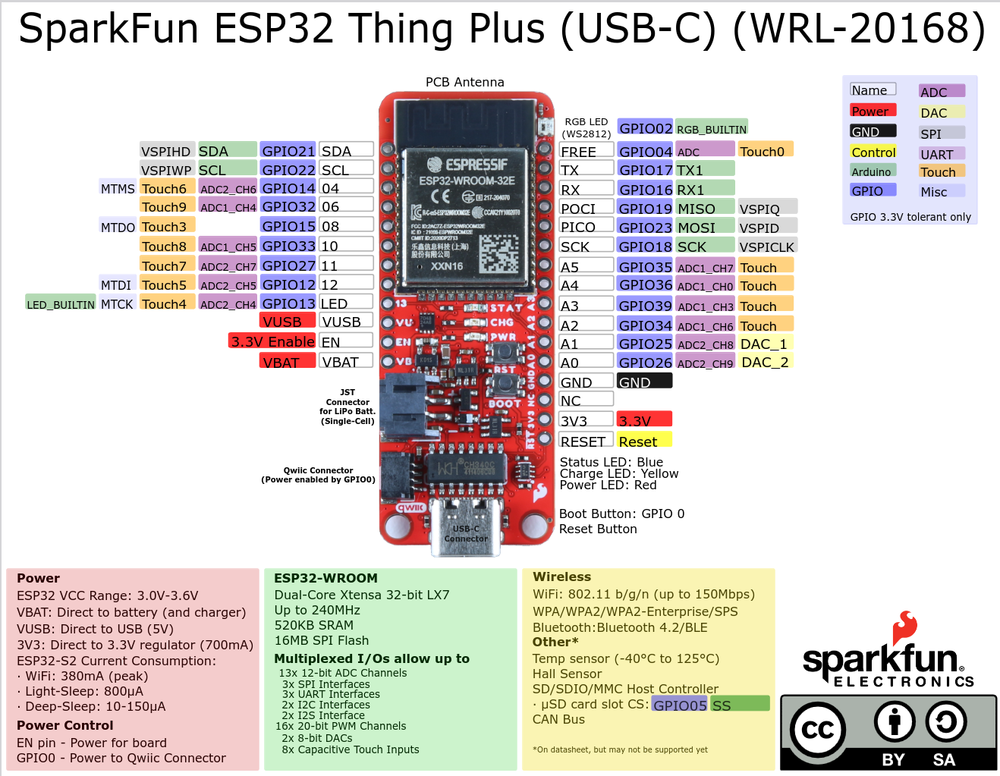

# Assembly of Stethoscope Brick

## Required Parts
- Fully Assembled Stethoscope PCB
- EPS Microcontroller, Adafruit Feather ESP32 S3 or Spakrfun Thing Plus C
- AWG 22 or AWG 24 Silicone Wire [Amazon](https://a.co/d/58djefc)
- Stainless steel tubing, 7mm OD, 5mm ID
- Stethoscope
- Inflatable arm cuff (pressure option)
- Miscellaneous parts:
  - M3 screws 20mm and nuts for PCB mount
  - M3 screws  and nuts for PCB mount
  - Tubing and adapters

The suggested stethoscope rubber tube has ID 5mm and uses a barb with 8mm OD. 

The suggested pressure cuff tube has ID 4mm and uses barb with barb 7mm OD.

- Rubber Tubing from Honeywell pressure sensor to arm cuff (2mm ID OD 4mm OD)
- Luer Lock 3/32 barbed adapter for rubber tubing from pressure sensor
- Luer Lock 5/32 barbed adapter for pressure cuff tube

## 3D Printed Parts
For the design models refer to the README file.

- Medibrick Housing
  - Sensor Housing bottom part
  - Sensor Housing top part
- Microphone Housing
  - Microphone Housing bottom part
  - Microphone Housing top part
- Side Plate

## Electronics

### Instructions

Attach color coded wires to the IO pads. E.g. red for power, black or green for ground and blue or white for digital input/output and yellow for analog wires. 

You can insert the wires into the holes (perpendicular) or or you can attach a short piece of the wires on top of the pad (perpendicular).

Suggested connections for the Sparkfun Thing Plus (USB-C) and the Adafruit Feather ESP32-S3 are given below.

#### Connections

PAD       | Function        | Thing Plus    | Feather
---       |---              |---            |---
**GND**   | Ground          | GND           | GND   
**3.3V**  | Power           | 3V3           | 3V3
**SDA**   | SDA / CDATA     | SDA  / GPIO21 | SDA  / GPIO3
**SCL**   | SCL / CCLK      | SCL  / GPIO22 | SCL  / GPIO4
**DOUT**  | Data Out        | POCI / GPIO19 | MISO / GPIO37
**LRCLK** | WS/Word Clock   | A5   / GPIO35 | A5   / GPIO8 / ADC1-CH7
**DIN**   | Data In / DSDIN | PICO / GPIO23 | MOSI / GPIO35
**SLCK**  | Bit Clock       | SCK  / GPIO18 | SCK  / GPIO36
**MCLK**  | Master Clock    | LED  / GPIO13 | A4   / GPIO14 / ADC2-CH3
**3.3V**  | Power           | 3V3           | 3V3

Require connections are in **bold**.

#### Button

The button is configured to pull a pin high. One button pin is connected to 3.3V and the other to the input pin on the microcontroller. In software that pin is pulled low.

PAD       | Function        | Thing Plus    | Feather
---       |---              |---            |---
**3.3V**  | Power           | 3V3           | 3V3
**Button**| Button          | 9 or A0       | 12

#### Pressure Sensor
The MPRLS0300YG end of conversion output and external reset input.

PAD       | Function          | Thing Plus | Feather
---       |---                |---         |---
**EOC**   | End of Conversion |            | D10
**RST**   | Reset             |            | D11

#### Pinouts

- [Thing Plus C Pinout](https://cdn.sparkfun.com/assets/3/9/5/f/e/SparkFun_Thing_Plus_ESP32_WROOM_C_graphical_datasheet2.pdf)
- [ESP32 S3 Pinout](https://learn.adafruit.com/assets/110811)

