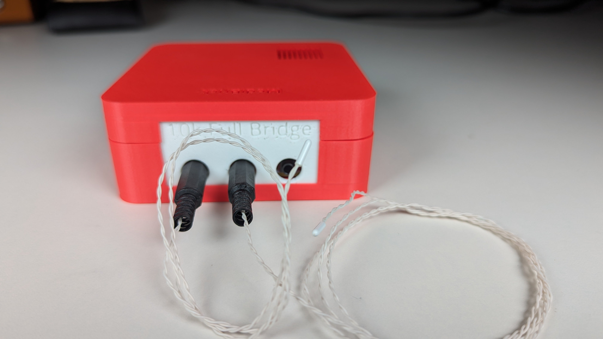
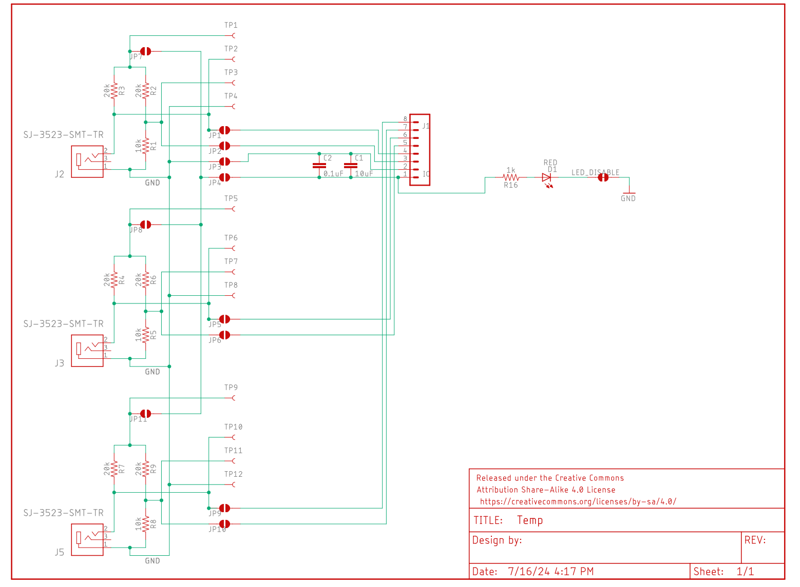
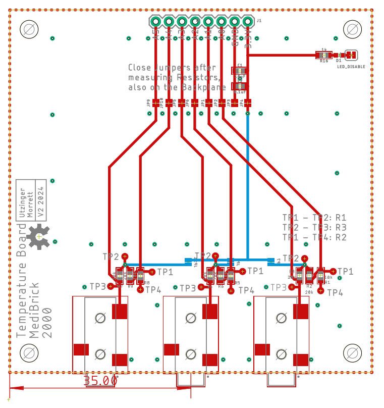

# Thermistor/Wheatstone Brick

This Thermistor solution is based on a calibrated Wheatstone bridge. The Voltage potential over the thermistor is measured  and compared to a fixed voltage divider. Three thermistors can be measured using the micro controllers internal analog to digital converter. In order to achieve accuracy, the ADC is run a audio frequencies and measurements are averaged. Although ESP32 internal ADC is not of high quality, with the help of linearization and signal averaging, accurate temperature readings are achieved. 

## Costs &#36;

| Item        | Quantity at Purchase | Costs  | Source            | Cost per Brick
|---                          | ---  | ---    | ---               | ---
| Microcontroller             |  1   | $17.5  | [Adafruit](https://www.adafruit.com/product/5477)          | $17.5
| Display                     |  5   | $13    | [Amazon](https://a.co/d/1QH0Ab9)            | $3
| Button                      | 25   | $9     | [Amazon](https://a.co/d/8KAuTwC) | $0.5 
| Battery                     |  1   | $10     | [Adafruit](https://www.adafruit.com/product/258)        | $10
| PCB                         |  5   | $45.20  | PCBWay            | $9
| Parts and Assembly          |  2   | $99.16* | PCBWay            | $50
| Thermistors MA1000GG103AN **|  1   | $6      | [Amphenol](https://www.mouser.com/ProductDetail/Amphenol-Advanced-Sensors/MA100BF103AN?qs=wrT8kFYR7791l5TjYdzP%252BA%3D%3D) | $6
| 3.5mm male audio connector  | 10   | $10    | [Amazon](https://a.co/d/bbEIi9s) | $1
| Assorted Wires              |8m    | $15    | [Amazon](https://a.co/d/58djefc) | $1
| Assorted Screws and Nuts    |100   |  $7    | Amazon            | $0.05
| Assorted 3D printed parts   |      |        |  | $3
|                             |      |        |                   |
| **Total**                   |      |        |                   | **$100**

*Electronic components are $12 per board. 

**MA100BF103 also comes in less accurate and less expensive versions: MA100BF103BN and  MA100BF103CN.

## Test Software &#128187;
Test software is located in the Arduino folder.

| Folder | Description | 
|--- |---|
|MediBrick_Temperature_Test | Computes calibrated temperature. |

## Microcontroller Software : &#9000;
Not finalized yet

## Electronics Design &#128268;

The following files are needed for PCB manufacturing and assembly.

- [Bill of Materials](Temp_BOM.xlsx)
- [Manufacturing Files](Temp_2024-07-16.zip)
- [Pick and Place](Temp_PnP.xlsx)

The Bill of Materials is formatted so that its compatible with PCBWay submissions.

## 3D Printed Parts &#9881;
These are the links to the OnShape Design files, which you can edit and modify if you have an OnShape account (OnShape has free academic accounts).

- Medi Brick
  - [Brick Top](https://cad.onshape.com/documents/be6b7e5f847d89f3ec5eb9d5/w/761fee9865ca7ef709028476/e/ff897b4f359cec83b782ff14)
  - [Brick Bottom](https://cad.onshape.com/documents/92ad78475e8f0b17ff5e260b/w/88a02abbcb12cdbd4d9de3ad/e/fb79ca58ad2b6a0298e9d1b6)
  - [Brick Assembly](https://cad.onshape.com/documents/11cbfe9c3c739b6e8ecbf3d7/w/989b564ecd7f6d069e643ac0/e/85542f706be8cc7554218e8d)
  - [Temperature Brick Side Plate](https://cad.onshape.com/documents/dac7e67c5b0270015712d245/w/d60526c34fb0e9aab2c02a4b/e/a363f2f519f137cd253c6eda?renderMode=0&uiState=6712d9ca15dc976491f436f6)

