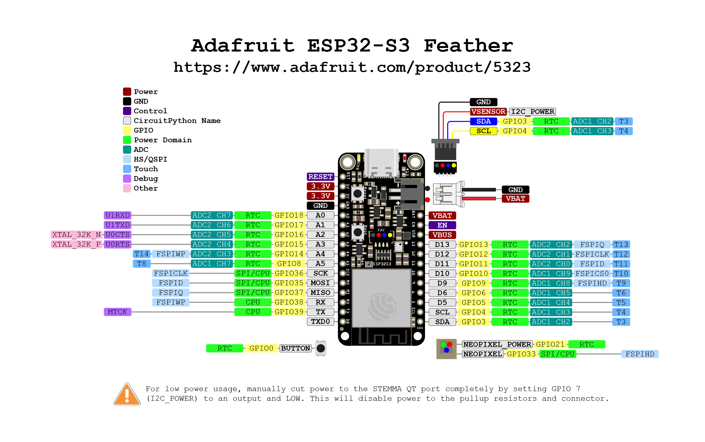

# Assembly of Thermistor Board

## Board Recommendation

We need 6 ADC from ADC unit 1 exposed. Some boards use I2C pins and ADC unit 1 channels.

There is also difference between ESP32 models. ESP32-S3 as maximum sampling rate of 83kHz where ESP32 has 2MHz. 

I recoomend using Sparkfun Thing Plus or Thing Plus C.

When setting up the Wheatstone bridge the supply voltage is about 3.3V.
All resistors are in the range of 10k Ohm.
If the thermistor is NTC type resistance will decrease with temperature.
The miniumum at 45C will be 4k and the maximum at freezing bout 35k.
Therefore one Voltage will be constant at about 1.6V and the other 0.9 .. 2.5V.

Therfore ADC setting for ESP32 should be choosen as following:

| Choice              | Description    | Voltage Range   |
|---------------------|----------------|-----------------|
| ADC_ATTEN_DB_0,     | No attenuation | 0.1  to 0.95 V  |
| ADC_ATTEN_DB_2_5    | 2.5 dB         | 0.1  to 1.25 V  |
| ADC_ATTEN_DB_6      |   6 dB         | 0.15 to 1.175 V |
| **ADC_ATTEN_DB_11** |  11 dB         | 0.15 to 2.45 V  |

Also the bridge resistors should be changed so that R1 and R3 resistor is 20k and R3 is 10k. This would allow more accurate measurement of temperature in physiogical range.

## Soldering

Attach color coded wires to the IO pads. E.g. red for power, black or green for ground and blue or white for digital input/output and yellow for analog wires. 

You can insert the wires into the hbloles (perpendicular) or or you can attach a short piece of the wires on top of the pad (perpendicular).

Suggested connecctions for the Sparkfun Thing Plus (USB-C) and the Adafruit Feather ESP32-S3 are given below.

### Connections

Analog input needs to be on same ADC unit in order to use fast contiunous ADC on ESP32.
On Adafruit Feather ESP32-S3 we have only 5 pins available for ADC1 and two are also used for I2C.
In addition ESP32-S3 has maximum sample rate of 83kHz where as Thing Plus ESP32 has 2MHz

PAD      | Function    | Thing Plus     | Feather
---      |---          |---             |---
**A5**   | analog CH1A | A5 ADC1-CH7    | D9  ADC1-CH8
**A4**   | analog CH1B | A4 ADC1-CH0    | D10 ADC1-CH9
**A3**   | analog CH2A | A3 ADC1-CH3    | D11 ADC1-CH4
**A2**   | analog CH2B | A2 ADC1-CH6    | D12 ADC1-CH5
**A1**   | analog CH3A | 06/32 ADC1-CH4 | not exposed  
**A0**   | analog CH3B | 10/33 ADC1-CH5 | not exposed
**GND**  | Ground      | GND            | GND
**3.3V** | Power       | 3V3            | 3V3

Require connections are in **bold**.

### Pinouts
- [Thing Plus C Pinout](https://cdn.sparkfun.com/assets/3/9/5/f/e/SparkFun_Thing_Plus_ESP32_WROOM_C_graphical_datasheet2.pdf)
- [ESP32 S3 Pinout](https://learn.adafruit.com/assets/110811)

## Calibration

The resistors are configured the following way:

made with https://www.circuit-diagram.org/editor

The Wheatstone bridge resistors should be measured for greater accuracy.

- TP1 - TP3 R1
- TP1 - TP2 R2
- TP2 - TP3 R3

The thermistor resitance is

$R_{Thermistor} = \frac{R_3 (V_{in} R_2 - V_{diff} (R_1+R_2))}{Vin R1 + Vdiff (R_1+R_2)}$

Where $V_{diff} = V_1 - V_2$

$V_1$ and $V_2$ are measured with a microcontroller's ADC converter and they correspond to A0-A1, A2-A3 and A4-A5. ESP ADC is of low quality and linarization and averaging in software is needed.

After measuring the three resistors of each of the channels we need to close all jumpers in the circuit. There are 11 jumpers. 

## Termistor
Amphenol 10kOhm MA100
https://www.mouser.com/datasheet/2/18/Amphenol_04022020_AAS_920_321E-1826352.pdf

| Temperature | Resistance | 10/R | 10/10 | 20/R | 20/10 |
|---          |---         |---   |---    |---   |---    |
| 32C         | 32739 Ohm  | 2.70 | 1.76  | 2.19 | 1.18  |
| 41C         | 25441 Ohm  | 2.53 | 1.76  | 1.97 | 1.18  |
| 50C         | 19925 Ohm  | 2.35 | 1.76  | 1.76 | 1.18  |