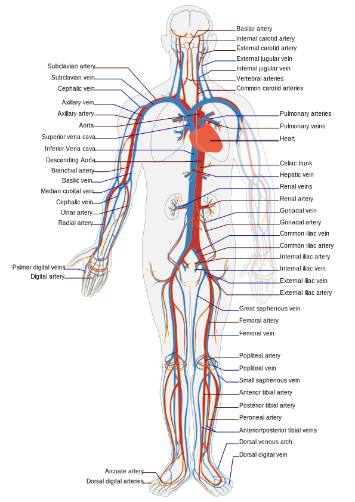
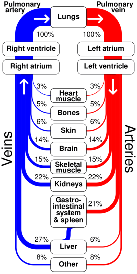
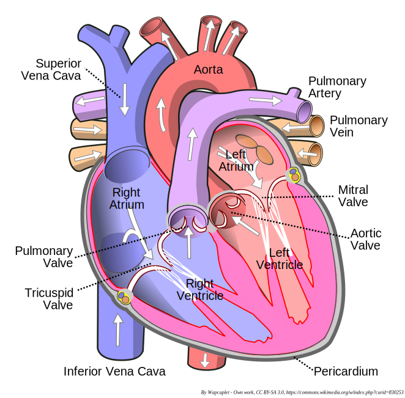
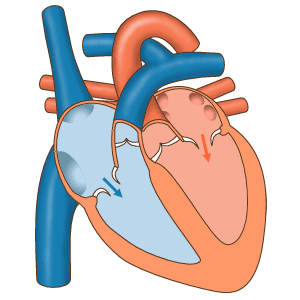
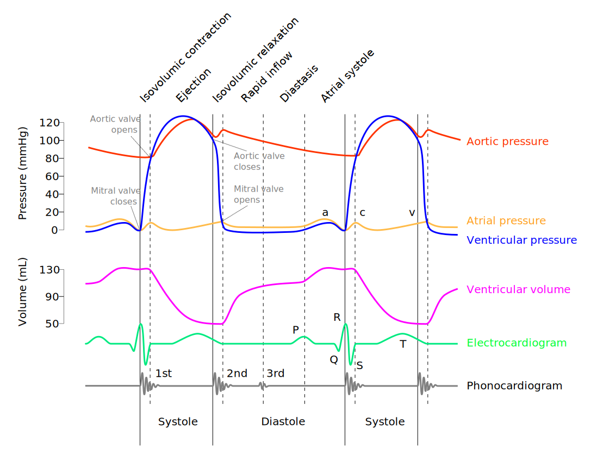

# Cardiac Physiology

## Circulatory System

<!-- Circulatory System Figure -->

Figure: Circulatory System. Major genetically predetermined arteries and veins of the body.

<!-- Flow Distribution Figure -->

Figure: Flow distribution of the cardiac output.

## Heart

<!-- Heart Anatomy Figure -->

Figure: Heart Anatomy. Many of the signals measured in this project are defined by the activity of the left ventricle.

<!-- Heart Contraction GIF -->

Figure: Heart Contraction.

## Wigger's Diagram

<!-- Wigger's Diagram Figure -->

Figure: Wigger's diagram is an excellent tool to teach cardiac physiology, showing pressures found in the ventricle as well as the aorta and atrium. The sharp contraction resulting in the QRS complex and first heart sound as well as the second sound coinciding with the closure of the aortic valve. The repolarization of the heart muscle corresponding to the T wave.

All figures https://commons.wikimedia.org/