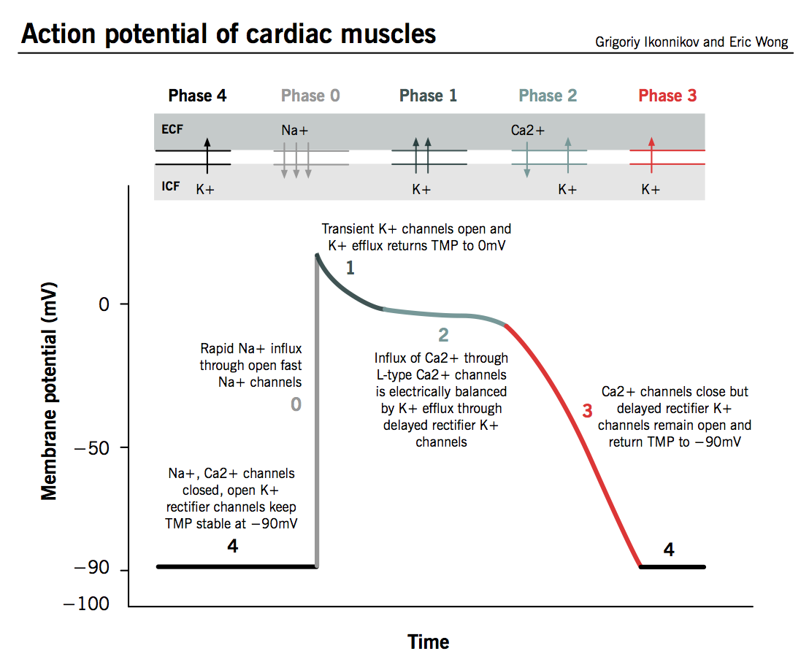
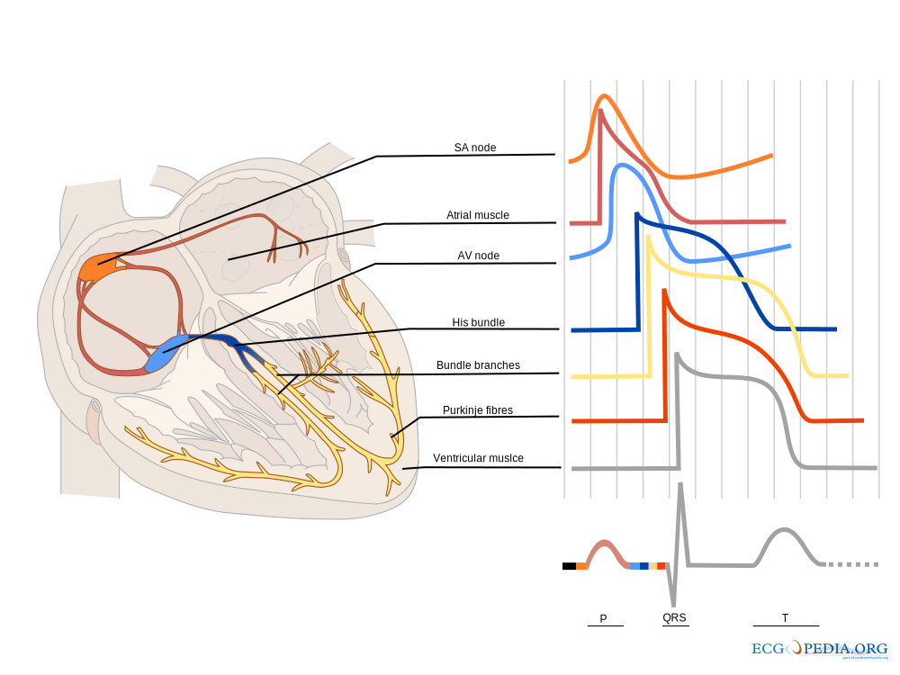

# Electro Cardio Graphy

To be written

## Physiology

    
    

Figures: https://commons.wikimedia.org/

The heart muscle creates a strong electric field that is measurable on the skin surface. Ion gradients from muscle cells sum up to a potential of ab out 3mV on the skin. To measure this signal with a modern analog to digital converter an ammplification of 100-300 is needed.

The muscle contraction of the left and right ventricle cause a sharp rise in the overall potential allowing for accurate heart rate measurements. 

Heart rate can also be measured with pelthysmography in a much safer manner. To record an ECG, electrodes need to be attached to the skin. Their contact chemistry and size reduce skin resistance to pickup the signal. These electrodes pose a safety concern because in case of an electrical failure, current can enter and exit through them more easily into the body. They are placed so that optimal signal from the heart can be measured which also results in optimal placement to inject current into the heart.  

### Electro Cardio Gram (ECG)

Heart muscle acticity

     
    

 

Figures https://commons.wikimedia.org/

## Composition of ECG Waveform

### Cell Membrane
 

http://www.ncbi.nlm.nih.gov/pmc/articles/pmc2828741/

### Singe Muscle Cell Electric Potential
 

https://www.pathophys.org/wp-content/uploads/2013/10/ActionPotential.png

### Combination of Signals
 

https://en.wikipedia.org/wiki/Cardiac_action_potential

### Triangle of Einthoven
 
https://en.wikipedia.org/wiki/Einthoven%27s_triangle

### ECG Interpretation

https://en.wikipedia.org/wiki/Atrial_fibrillation
https://en.wikipedia.org/wiki/Premature_atrial_contraction
https://en.wikipedia.org/wiki/Bundle_branch_block
https://en.wikipedia.org/wiki/Myocardial_infarction
