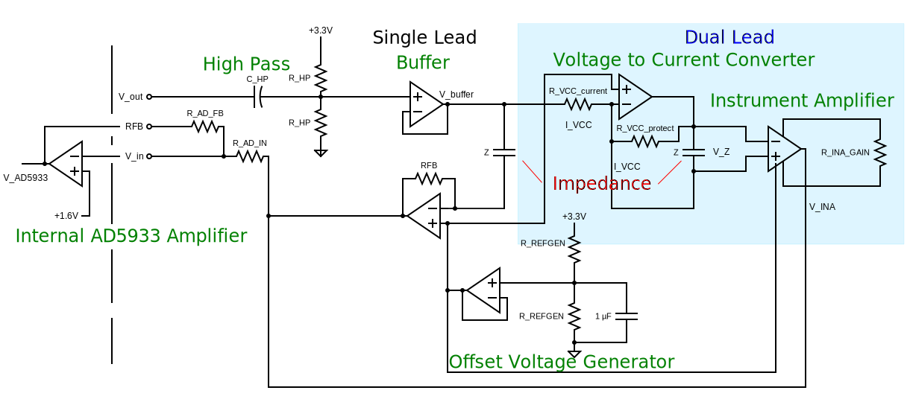

# Tissue Impedance

## IEC 60601 
IEC 60601 limits 10 µA maximum dc-leakage current through the body under normal conditions and 50 µA maximum under worst-case, single-fault conditions. An impedance circuit should not exceed that current.

## Analog Devices AFE
- [AD5933 12-bit impedance converter ($18)](https://www.analog.com/en/products/ad5933.html) evaluation kit available ($68)
- [User Guide with reference schematics](https://www.analog.com/media/en/technical-documentation/user-guides/UG-364.pdf)

## Maxim AFE
- Biopotential
  - ECG (waveform)
  - R-R (heart rate)
- Bioimpedance
  - Resp (respiration)
  - GSR (galvanic skin response, stress level)
  - EDA (electro dermal activity)

- [Max 30001G ($10)](https://www.maximintegrated.com/en/products/analog/data-converters/analog-front-end-ics/MAX30001G.html) for Biopotential and Bioimpedance, evaluation kit available ($113)
- [Maxim 30009](https://www.maximintegrated.com/en/products/sensors/MAX30009.html) for Bioimpedance, evaluation kit available ($212)

| PART | Features             | Resolution | Remarks |
|---   |---                   |---         |---      |
|AD5933|Single channel 3 wire | 12bit, 1Msps, 100kHz excitation| First Gen, 1024 point FFT, 1kOhm - 1MOhm
|AD5940/41 | 2 channel, 4 wire | 16bit, 800ksps, 200kHz | Impedance spectroscopy
|ADuC355 | 2 channel, 4 wire | 16bit, 800ksps, 200kHz | Impedance Spectroscopy, 26MHz ARM Cortex M3 MCU
| MAX30002 | single channel, BioZ, 2 or 4 wire | 17bit| 
| MAX30009 | single channel, BioZ, 2 or 4 wire | 16 kHz - 806 kHz |
| MAX30131/132/134 | 1-,2-,4- channel | 12 bit |
| MAX30001G | single channel, 2 or 4 wire | | Impedance and Potential (ECG)

## Skin Equivalent Circuits

There are several impedance models to measure body impedance:
- Whole Body Impedance Analysis (BIA) or Total Body Composition (TBC)
- Segmental Body Impedance for smaller regions in the body.
  - Respiratory Rate (RR) model.
  - Lung Composition (LC) model 
  - Pulmonary Edema (PE) mopdel.

Usually measurements occur from 1 (or 5) kHz to (100 or) 1MHz.

There are also models to describe the electrode to skin impedance as well as bare tissue impedance.

Paco et al [10] describes a skin electrode model and a tissue model:

| Model 1        | R   | r    | C nF |
|---             |---  |---   |---   |
| Skin_Electrode | 2k2 | 150k | 150  |
| Tissue         |  10 |  56k |  47  |

Ferreira et al [11] describe TBC, RR and LC models:

| Model 2 | R     | r      | C nF |
|---      |---    |---     |---   |
| TBC     | 917.5 | 665.4  | 3.42 |
| RR      |  58.5 |  25.58 | 75.7 |
| LC      |  81.5 |  22.15 | 47.7 |

### Model 1 (2014) 

### Model 2

## Using AD5933 for Bioimpedance

From [1] and [2], made with https://www.circuit-diagram.org/editor

### AD5933 Evaluation Board

The evaluation board from Analog Devices includes the reference design describing an analog front end to measure low impedances.

On the excitation side it has a passive high pass filter with $R_{HP}$, $C_{HP}$ and an OpAmp buffer.

On the measurement side it has an amplifier with $V_{DD}/2$ on the positive input and feedback resistor RFB.

The input to the AD5933 has $R_{AD_{IN}}$ of 20K as well as a $R_{AD_{FB}}$ of 20K.

### Analog Frontend for Bioimpedance 

Munoz et al [2] describe their implementation in a 2022 paper. Several other web publications exist using that design.

For bioimpedance measurements the following analog front end elements should be used: a high-pass filter (HPF), a voltage-to-current converter (VCC), and an instrumentation amplifier (INA).

The HPF is a first order system composed of a 100 kΩ resistor and a 10 nF capacitor to remove the DC components of $V_{out}$. $f_c = 1 / (2 \pi R C)$ resulting in 160Hz. 

The HPF output is connected to VCC, which consists of an operational amplifier and two resistors. The current injected into the tissue should not exceed 10 uA. 

$R_{VCC current} = 1 kΩ$ (This will exceed 10 µA!)

$R_{VCC_{protect}} = 10 kΩ$

Because the impedance is supposed to vary from tens to hundreds of ohms, 

$R_{feedback} = 10 kΩ$ 

ensures that current flows mainly through $Z_{Load}$, which is connected in parallel to $R_{feedback}$.

The current through VCC is

$R_{VCC_{curent}} = (V_{out} - V_{ref}) / R_{VCC_{current}}$. 

Therefore the voltage over $Z_{load}$ is

$V_{Z_{load}} = -(V_{out} - V_{ref}) / R_{VCC_{current}} * Z_{load}$.

The unity gain instrumentation amplifier receives, through its non-inverting input, the voltages on the electrodes connected to $Z_{load}$. Since the ADC converter of the AD5933 is unipolar, a potential ($V_{ref}$) is added as reference voltage to the instrumentation amplifier. The output of the INA is 

$V_{INA} =  V_{load} + V_{ref}

The current through $R_{AD_{IN}}$ is:

$(V_{INA} - V_{ref})/R_{AD_{IN}}$

The output of the internal OpAmp in the AD5933 is 

$I_{RFB} * R_{AD_{FB}}$

Therefore 

$V_{AD5933} = (V_{INA} - V_{ref})/R_{AD{IN}} * R_{AD_{FB}}$.

The DSP of the AD5933 calculates the real and imaginary parts of $Z_{load}$, which are read through an inter-integrated circuit (I2C) protocol by a micro controller.

### Electrical Components

A list of designs using the AD5933 used the following values for resistors and capacitors:

| Design        | $C_{HP}$ | $R_{HP}$ | $RFB$ | $R_{VCC_{current}}$ | $R_{VCC_{protect}}$ | $R_{INA_{GAIN}}$ | $R_{REFGEN}$ | $R_{AD_{IN}}$ | $R_{AD_{FB}}$ | $VCC +$
|---            |---   |---    |---   |---            |---              |---            |---       |---      |---      |---
| Eval [1]      | 47nF | 49.9k | 200k | N.A.          | N.A.            | N.A.          | 49.9k    | 20k     | 20k     |
| Datasheet [3] | 47nF | N.S.  | N.S. | N.A.          | N.A.            | N.A.          | N.S.     | 20k     | 20k     |
| Munoz [2]     | 10nF | 100k  | N.A. | 1k            | 10k             | Gain=1        | 1k       | 1k      | 1k      | GND
| Instru Bio [4]| 10nF |  10k  | N.A. | 1k            |  1k             | Gain=10,5.5k  | VDD/2    | 1k      | 1k      | GND
| Instru BIA [5]| 10nF | 100k  | N.A. | 1M            |  1M             | Gain=1.5,100k | VDD/2    | 1k      | 1k      | GND
| Instru BIA [6]| 10nF | 100k  | N.A. | 285k          |  1M             |               | VDD/2    |         |         | VDD/2
| Instru Thor[7]| 1.2nF|  10k  | N.A. | 1M            |  1M             | Gain=1.5,100k | 1k       | 1k      | 1k      | GND
| Instru Thor[8]| 100nF|  20k  | N.A. | 100k          |  10k            | Gain=1.5,100k | 3.2/1k   | 1k      | 1k      | GND
| UA 2023       | 10nF | 100k  | N.A. |  82k          |  82k            | Gain=51,1k    | 20k      | 20k     | 20k     | VDD/2
| UA 2024       | 10nF | 100k  | 200k | 265k          |   1k            | Gain=51,1k    | 10k      | 20k     | 20k     | VDD/2

- Network Analyzer AD5933
- Operation Amplifier(s) AD8608 or AD8606 or AD8605
- Instrumentation Amplifier INA826AID

#### High Pass
- $1 / (2 \pi R C)$, should attenuate 50 and 60Hz, need 200Hz..xxkHz
- 10nF, 100k fc=160Hz

#### $R_{current}$ and $R_{protect}$
- Input into VCC is at 1.65V offset with 1V amplitude. With $I_{CC} <10uA$ and $V_{CC} = 2.65V$ and $R_{VCC_{current}}$ will need to be 265kΩ.
- Setting of Range 1 in AD5933 is 1V if operating at 3.3V., for $10 \mu A$ we need 110kΩ for $R_{VCC_{current}}$.
- Analog Devices: "Bio-Impedance Circuit Design for Body Worn Systems"

#### $R_{Gain}$ 
- $G = 1 + (49.4k/R_{Gain})$
- With $R_{INA_{GAIN}}$  = 1kΩ the gain will be $G=51$

### Impedance Estimation

Formula to compute impedance from measurements. Check evaluation board and Instructables.

### References

For general reading: [Analog Devices: Bio-Impedance Circuit Design for Body Worn Systems"](https://www.analog.com/en/resources/analog-dialogue/articles/bioimpedance-circuit-design-challenges.html)

1) [Analog Devices AD5933 Evaluation Board, User Guide](https://www.analog.com/media/en/technical-documentation/user-guides/UG-364.pdf)
2) [Munoz et al](https://doi.org/10.1016%2Fj.ohx.2022.e00274)
3) [AD5933 Datasheet](https://www.analog.com/media/en/technical-documentation/data-sheets/AD5933.pdf)
4) [Instructables Body Composition](https://www.instructables.com/Determining-Body-Composition-using-Arduino)
5) [Instructables BIA 1](https://www.instructables.com/Body-Composition-using-BIA/)
6) [Instructables BIA 2](https://www.instructables.com/Bio-Impedance-Analysis-BIA-With-the-AD5933/)
7) [Instructables Thor 1](https://www.instructables.com/Thoracic-Impedance-1/)
8) [Instructables THor 2](https://www.instructables.com/Thoracic-Impedance/)
9) [IEEE Tutorial](https://ieeexplore.ieee.org/document/9529213)
10) [Uwe Pliquett, Andreas Barthel, 2012 J. Phys.: Conf. Ser. 407 012019](https://iopscience.iop.org/article/10.1088/1742-6596/407/1/012019)
10) [Paco Bogonez-Franco et al, 2014, Problems encountered during inappropriate use of commercial bioimpedance devices in novel applications, 7 th International Workshop on Impedance Spectroscopy 2014](https://www.researchgate.net/publication/269571754_Problems_encountered_during_inappropriate_use_of_commercial_bioimpedance_devices_in_novel_applications)
12) [J Ferreira et al 2010 J. Phys.: Conf. Ser. 224 012011](https://iopscience.iop.org/article/10.1088/1742-6596/224/1/012011/pdf)