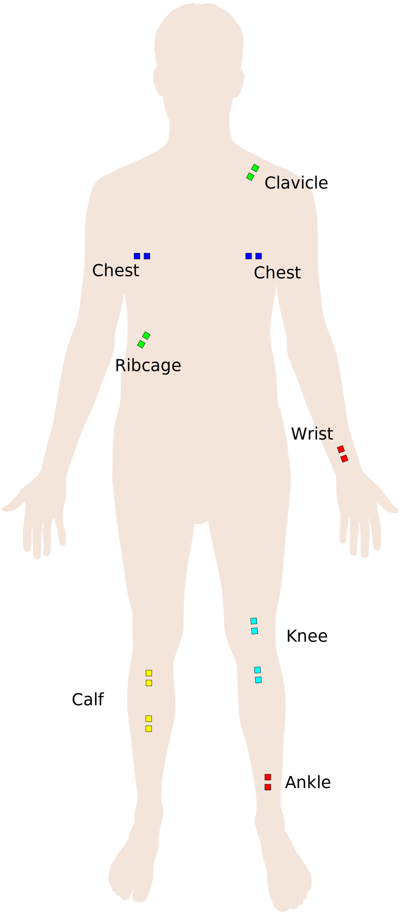
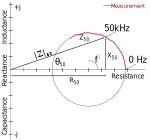
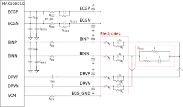

# Body Impedance

Electrical impedance is measured similarly to measuring the resistance of resistor with a multimeter. However, we also obtain reactance and the measurement is conducted with alternating current. Impedance is usually a 4-wire measurement technique where two electrodes are used to inject current into the sample and two more electrodes are used to measure the resulting potential. One can also use just two electrodes and even record a low frequency signal such as an ECG from the same electrodes as the impedance measurement. With the help of a demodulator (mixer), impedance measured at a given frequency is converted to a constant signal at 0 Hz that can be pickedup with a simple direct current measurement. The math section below explains this principle.

Intracellular and extracellular fluids contain ions that will migrate under the influence of an electric field. This is in contast to conductors and semiconductors where current is based on free electrons. Extracellular conductance is mainly due to Na+ and Cl− ions. Free proteins in the blood plasma are negatively charged and contribute also to the conductance. Extracellular and intracellular fluids are primarily resistive while cell membranes act as barriers to current flow at low frequencies acting as cpacitors. The epidermis acts more as a dielectric with some  conductive properties, while muscle tissue acts primarily as a conductor with some dielectric properties 

Thus, tissue impedance depends on intracellular and extracellular water content as well as ion concentrations, but also on fat content. Edema is an accumualtion of fluids and will change impedance. Inhalation increases the lung volume and since air is an insulator, should increase chest impedance. Total body compoisition such as muscle mass, water content and fat content affect impedance.

For Bio Impedance measurements (BIOZ), impedance is typically measured at frequencies higher than the ones representing the ECG (>1kHz). Historically an alternating current at 50kHz is used for impedance analysis on the body, however 5-100kHz or 1-1000kHz is also used for impedance spectroscopy. 

For impedance analysis, the total body but also regions of the body can be evaluated:

- **Whole Body** Impedance Analysis (BIA) or **Total Body Composition** (TBC)
- **Segmental Body** Impedance for smaller regions in the body.
  - **Respiratory Rate** (RR) model.
  - **Lung Composition** (LC) model 
  - **Pulmonary Edema** (PE) model.

For these measurements electrodes are placed on the following locations.

| Model   | Electrode 1 | Electrode 2   |
|---      |---          |---            |
| TBC     | Ankle       | Wrist         |
| RR      | Chest       | Chest         |
| LC      | Clavicle    | Ribcage       |
| Knee    | Distal Knee | Proximal Knee |
| Calf    | Distal Calf | Proximal Calf |

Besides **Impedance Analysis** there is **Impedance Spectroscopy** where impedance is measured at multiple frequencies. When changing frequencies a reactance versus resitance graph can be plotted as shown below. When conducing an impedance measurement at 0Hz reactance is zero and with increasing frequency reactance increases. At infinit freuency resistance is the lowest. When no physiological processes change impedance the values measured at different frequencies will fall onto a circle.

## Mathematical Description of Impedance Measurement

- $R$: Resistance (real part of impedance, measured in Ohms)
- $X$: Reactance (imaginary part of impedance, measured in Ohms)
- $j = \sqrt{-1}$ (the imaginary unit)

The impedance $( Z )$ is defined as comlpex number:

$$
Z = R + jX
$$

where $( Z )$ is measured in Ohms ($\Omega $).

This can also be expressed in **Euler's form** as:

$$
Z = |Z| e^{j\theta}
$$

where:
- **Magnitude**: $|Z| = \sqrt{R^2 + X^2}$
- **Phase**: $\theta = \tan^{-1}\left(\frac{X}{R}\right)$

In **rectangular form**, impedance is:

$$
Z = |Z| (\cos(\theta) + j \sin(\theta))
$$

where:
- Real part $R = |Z| \cos(\theta)$ is resistance,
- Imaginary part $X = |Z| \sin(\theta)$ is reactance.

The phase property will result in a phase delay between alternating current and the measured potential, while the magntiude determines the signal strenght of the measured potential.

## Bio Impedance Analysis

In review articles attempting to fit body composition with impedance measurements, the following common variables are used:

- $H$ Height in [cm]
- $R$ Resistance in [Ω], $R_{50}$ Resistance at 50kHz
- $X$ Reactance in [Ω]
- $Z$ Impedance $Z = R + jX$
- $W$ Weight [kg]
- $A$ Age in [years]
- $V_b$ Body Volume [liter]
- $V_e$ Extra Cellular Water (ECW) Volume in [liter]
- $V_i$ Intra Cellular Water (ICW) Volume in [liter]
- $V_t$ Total Body Water (TBW) Volume in [liter]
- $FFM$ Fat Free Mass in [kg]
- sex, with 0 for male and 1 for female tissue

For comparison with a simple resistor with a given resistivity $\rho$  [Ω cm], its resistance is $R=\rho L / A$ with A the crossection and L the length of the resistor.

### Fat Free Mass, Total Body Water, Total Body Potassium

In 1985 publication by Lukasaki [3] that was cited more than 2500 times, the authors used a 50kHz signal with 800 micro Ampere to assess the fat free body mass, total body water and total body potassium. They measured left wrist to left ankle impedance and assumed that reactance is small compared to resitstant and therefore $V = \rho L^2 / R$  They found linear relationship between their volumes and mass estimates.

$Y = {Height}^2 / R_{50}$ in units [ $cm^2 / \Omega$]

| Fat Free Mass [kg] | Total Body Water [L] | Total Body Potassium [g] |
|---            | ---              | ---                  |
| $X =  3.04 + 0.85 * Y$ | $X = 2.03 + 0.63 * Y$ | $X = -23.09 + 2.56 * Y$  |

### Water Volumes

Jaffrin et all [5] summarized several Impedance Anlysis modles in their review paper. 

#### Total Body Water

- $V_{TBW} = 0.5561 \cdot H^2/R_{50} + 0.0955 \cdot W + 1.726$
- $V_{TBW} = 0.446  \cdot H^2/R_{50} + 0.126  \cdot W + 5.82$
- $V_{TBW} = 4.65 + 0.377  \cdot H^2/R_{50} + 0.14   \cdot  W - 0.08 \cdot A + 2.9  \cdot  sex$
- $V_{TBW} = 6.53 + 0.3674 \cdot H^2/Z_{50} + 0.1753 \cdot  W - 0.11 \cdot A + 2.83 \cdot  sex$

#### Extracellular Water

- $V_{ECW} =      0.0119 \cdot H^2/X_{50} + 0.123 \cdot H^2/R_{50}        + 6.15$
- $V_{ECW} = -5.22 + 0.2 \cdot H^2/R_{50} + 0.005 / X_{50} + 0.08 \cdot W + 1.9 + 1.86 \cdot sex$

## Bio Impedance Spectroscopy

For impedance spectroscopy, measurements occur at frequencies ranging from 1 (or 5) kHz to (100 or) 1MHz.

Here, I need to expand on analysis of resitance versus reactance plot.

## Electric Equivalent Models for Bioimpedance

There are models to describe the tissue impedance and also the electrode to skin impedance asw simple electrical circuit:

| Tissue Mopdel          | Electrode Model        |
|------------------------|------------------------|
|  |  |

Ferreira et al [2] used the tissue model  to describe Total Body Composition (TBC), Respiratory Rate (RR) and Lung Composition (LC) and used the following values:

| Model   | R [Ω]    | r [Ω]  | C [nF] |
|---      |---    |---     |---   |
| TBC     | 917.5 | 665.4  | 3.42 |
| RR      |  58.5 |  25.58 | 75.7 |
| LC      |  81.5 |  22.15 | 47.7 |

Here $R$ represents the extracellular current resistance, $r$ the interacellular resistance and $C$ the capcitance introduced by cell membranes.

Paco et al [1] used the electrode model to describe measurements on the calf. The MAX30001G data sheet lists values for an electrode model that is used for a calculation where the ideal current is computed:

| Model   | R [Ω]    | r [Ω]  | C [nF] |
|---                 |---  |---   |---   |
| Electrode (Paco)   | 2k2 | 150k | 150  | 
| Electrode (30001G) | 100 |   1M |   5  |
| Calf Tissue        |  10 |  56k |  47  |

## Electric Equivalent Circuit with MAX30001G

For an example current calculation see page 36 of MAX30001G data sheet. 

I should expand the calculations here with values for the actual tissue model as in the datasheet its just a 100 Ohm resistor. Also the computation for expected noise should be included here.

## Appendix: Mathematical Derivations

### Applying Oscillating Current

When applying an alternating current to an impedance $Z$, the measured voltage is given by Ohm's law:

$$
V(t) = I(t) \cdot Z
$$

When:
- **Frequency $( f )$** is in Hz,
- $\omega = 2 \pi f$ is the angular frequency in radians per second.

We define the oscillating current as:

$$
I(t) = I_0 \sin(\omega t)
$$

or, in **Euler's form**:

$$
I(t) = \text{Re} \left\{ I_0 e^{j\omega t} \right\}
$$

The measured voltage across the impedance becomes:

1. In **Euler's form** (complex exponential form): $V(t) = I_0 \cdot |Z| \cdot e^{j(\omega t + \theta)}$

2. In **real form** (sinusoidal): $V(t) = I_0 \cdot |Z| \cdot \sin(\omega t + \theta)$

### Demodulation

When we demodulate the measured voltage by mixing it with an oscillating signal that has the same frequency but a phase offset, we multiply the measured signal with the demodulation signal:

The demodulation signal is:

   $$
   \sin(\omega t + \phi_{\text{offset}})
   $$

The demodulated Voltage becomes:

   $$
   V_{\text{demod}}(t) = I_0 \cdot |Z| \cdot \sin(\omega t + \theta) \cdot \sin(\omega t + \phi_{\text{offset}})
   $$

Using the trigonometric identity:

   $$
   \sin(\alpha) \cdot \sin(\beta) = \frac{1}{2} \left[ \cos(\alpha - \beta) - \cos(\alpha + \beta) \right]
   $$

we have:

   $$
   V_{\text{demod}}(t) = \frac{I_0 \cdot |Z|}{2} \left[ \cos((\theta - \phi_{\text{offset}})) - \cos(2\omega t + \theta + \phi_{\text{offset}}) \right]
   $$

After applying a low-pass filter, which removes the high-frequency term $( \cos(2\omega t + \theta + \phi_{\text{offset}}) )$, the demodulated voltage becomes:

$$
V_{\text{demod}} = \frac{I_0 \cdot |Z|}{2} \cos(\theta - \phi_{\text{offset}})
$$

Thus, the demodulated voltage depends on the phase difference between the Impedance's phase $( \theta )$ and the demodulation signal's phase $( \phi_{\text{offset}} )$ and  can be measured with a simple DC reading.

### Obtaining Magnitude and Phase from multiple Measurements with varying phase offsets 

At a given frequency the unknonw tissue impedance is given as magnitude $∣Z∣$ and phase $\theta$.

When measurements are conducted at several phase offsets we can determine the impedance with a least squares fit. We will record the following values:

- $\text{measurement}[i] = |Z| \cdot \cos(\theta - \phi_i)$

This can be expanded using trigonometric identities:

- $\text{measurement}[i] = |Z| [ \cos(\theta) \cos(\phi_i) + \sin(\theta) \sin(\phi_i) ]$

This equation is linear with respect to $\cos(\phi_i)$ and $\sin(\phi_i)$, allowing us to set up a linear regression problem to solve for $A$ and $B$:

- $\text{measurement}[i] = A \cos(\phi_i) + B \sin(\phi_i)$

where:

- $A = |Z| \cos(\theta), \quad B = |Z| \sin(\theta)$

Using the least squares method, the normal equations are derived from minimizing the sum of squared errors. The normal equations for this problem are:

- $A \sum \cos^2(\phi_i) + B \sum \cos(\phi_i) \sin(\phi_i) = \sum \text{measurement}[i] \cos(\phi_i)$

- $A \sum \cos(\phi_i) \sin(\phi_i) + B \sum \sin^2(\phi_i) = \sum \text{measurement}[i] \sin(\phi_i)$

To solve the full set of normal equations. we use the following steps:

1)  Calculate the sums:
- $S_{\cos\cos} = \sum \cos^2(\phi_i)$ [1]
- $S_{\sin\sin} = \sum \sin^2(\phi_i)$ [1]
- $S_{\cos\sin} = \sum \cos(\phi_i) \sin(\phi_i)$ [2]
- $S_{\text{imp}\cos} = \sum \text{measurement}[i] \cos(\phi_i)$
- $S_{\text{imp}\sin} = \sum \text{measurement}[i] \sin(\phi_i)$

2) Setup the normal equations
- $A \cdot S_{\cos\cos} + B \cdot S_{\cos\sin} = S_{\text{imp}\cos}$
- $A \cdot S_{\cos\sin} + B \cdot S_{\sin\sin} = S_{\text{imp}\sin}$

3) Compute the determinant
- $\text{determinant} = S_{\cos\cos} \cdot S_{\sin\sin} - (S_{\cos\sin})^2$ [1,2]

4) Solve for $A$ and $B$
- $A = \frac{S_{\text{imp}\cos} \cdot S_{\sin\sin} - S_{\text{imp}\sin} \cdot S_{\cos\sin}}{\text{determinant}}$
- $B = \frac{S_{\text{imp}\sin} \cdot S_{\cos\cos} - S_{\text{imp}\cos} \cdot S_{\cos\sin}}{\text{determinant}}$

5) And finally obtain magnitude and phase:
- $|Z| = \sqrt{A^2 + B^2}$
- $\theta = \arctan2(B, A)$

Two conditions should be considered resulting in the following simplifications:
- Two measurements at 0 and 90 degrees phase offset. $S_{\cos\cos}$ and $S_{\sin\sin}$ will become 1 [1] and $S_{\cos\sin}$ 0 [2]. The determinant is 1. 
- When the phase offsets are spread uniformly over the full range of offsets which is from 0 to 360 degrees the $\cos(\phi_i) \cdot \sin(\phi_i)$ term can be neglected as the sum will become zero.

## Literature

1) [Paco Bogonez-Franco et al, 2014, Problems encountered during inappropriate use of commercial bioimpedance devices in novel applications, 7 th International Workshop on Impedance Spectroscopy 2014](https://www.researchgate.net/publication/269571754_Problems_encountered_during_inappropriate_use_of_commercial_bioimpedance_devices_in_novel_applications)

2) [J Ferreira et al 2010 J. Phys.: Conf. Ser. 224 012011](https://iopscience.iop.org/article/10.1088/1742-6596/224/1/012011/pdf)

3) Assessment of fat-free mass using bioelectrical impedance measurements of the human body, H C Lukaski, P E Johnson, W W Bolonchuk, G I Lykken, PMID: 3984933 DOI: https://doi.org/10.1093/ajcn/41.4.810, 2500 citations.

4) The Theory and Fundamentals of Bioimpedance Analysis in Clinical Status Monitoring and Diagnosis of Diseases by Sami F. Khalil, Mas S. Mohktar and Fatimah Ibrahim, Sensors 2014, 14(6), 10895-10928; https://doi.org/10.3390/s140610895

5) Body fluid volumes measurements by impedance: A review of bioimpedance spectroscopy (BIS) and bioimpedance analysis (BIA) methods, Michel Y. Jaffrin, Hélène Morel, Medical Engineering & Physics
Volume 30, Issue 10 , December 2008, Pages 1257-1269 https://doi.org/10.1016/j.medengphy.2008.06.009

9) [Kassanos et al 2021, IEEE Tutorial](https://ieeexplore.ieee.org/document/9529213) or https://doi.org/10.1109/JSEN.2021.3110283
