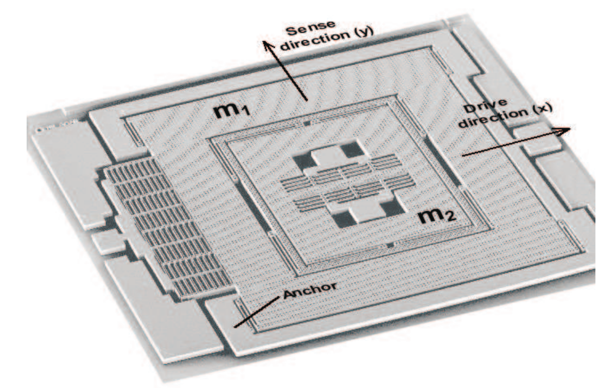

# Activity Measurements

Monitoring physical activty is important for helathy as well as frail subjects. 

In healthy patients, exercise regimes are menitored with step counts.

The orientation and movement of a device can categorize wether the subject is 
standing, sitting, walking, running or laying down.

For frail patients, in addition to acticity monitoring, a fall can be detected.

# Inertial Measurement Unit Medibrick

The IMU solution consists of an Inertial Measurement Unit (IMU) as well as a precision pressure sensor 
that can measre altitude based on athmospheric pressure.

The system can serve as attitude calculator, a step counter, speed estimator, as well as a level.

# IMU

A 9-axis IMU consits of an **acceleromter**, a **gyroscope** and optinally a **mangetometer**. 
It measures orientation of gravity, rotation rate of the system and the magnetic field vector.
For each of the 3 spatial coordinates the IMU internally uses 3 sensors oriented perpendicularly to each other. 
Through sensor fusion, the systems orientation as well its residual acceleration can be calcualted even when the sensor is moving.

Since gravity is strong, orientation measurement of the device is usually accurate. 
However rotation around the gravity vector (heading) requires a compass. 
The magnetic field is often disturbed indoors through metal reinforcement in the concret and electric fields of motors. 

In order to measure gyration (rate of rotation) a gyroscope is used. 
MEMS based gyroscopes measure corriolis forces. Their sensitivity does not allow to detect earth's roation. 
Their drift will need to be compensated during runtime. Light based gyroscopes are more accurate; they measure 
a spetral shift of light in a fiberoptic ring but their cost is orders of magntiude large than MEMS devices.

To compute translation and speed, gravity subtracted acceleration needs to be caclculated.
However the integration of a signal with a strong background such as gravity subtracted acceleration leaads to run off. 
Its usually not possible to compute position throgh an integration of speed with an IMU but speed can be estimated based 
on integration of acceleration.

## MEMS

Micro-electromechanical systems (MEMS) are devices created with processes developed for integrated circuits. 
Mechanical components are edged into Silicon.

A typical MEMS structure is shown below. Itis a **Comb Capacitor** used as electrostiatic mechanical driver.
WHen an electric potential is applied the electrostatic forces from the charge on the fingers of the comb drives the capacitor appart.
If an oscuillating potential is applied the comb will resonate and and through tuning of the frequency it can be drive at its eigen freuqency. 
A similar principle can be employed to measre the structures position by measuring the capacitance. 

https://ieeexplore.ieee.org/abstract/document/6495768

### Accelerometer

Buffa et al. Compact MEMS magnetometers for inertial measurement units https://doi.org/10.1007/s00542-013-1741-z

### Gyroscope

[Shel, Type I and Type II Micromachined Vibratory Gyroscopes](https://www.researchgate.net/publication/228641584)

### Mangetometer

[Bahreyni, Behraad, Univ. of Cambridge, Sensors Journal, IEEE 7(9), 2007](https://doi.org/10.1109/JSEN.2007.902945)

### Pressure Sensor

## Fusion Algorithm

 

[Magdewick, An efficient orientation filter for inertial and inertial/magnetic sensor arrays](https://forums.parallax.com/uploads/attachments/41167/106661.pdf)
