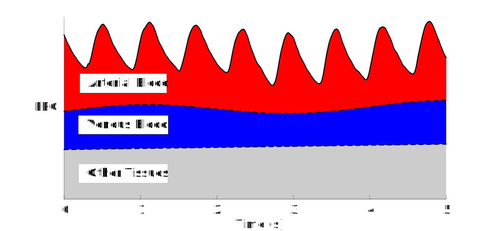
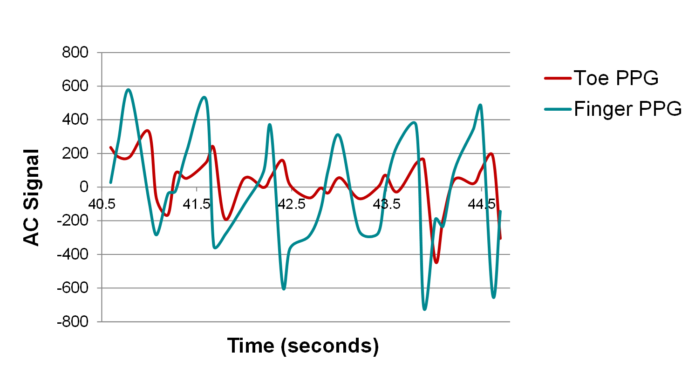

# Pulseoximetery

## Physiology

Oxygen and Glucose enable aerobic glycolisis which produces ATP. Oxygen is transported to the cells through perfusion and diffusion. Its taken up from the inhaled air and bound to hemgolbin in red bloodcells. The oxygnation is usually efficient and almostLuckilol all hemoglobin molecules pick up 4 oxygens.

The Oxygen Saturation is determined by the ratio of the concentration between oxy-hemoglobgin by the total concentration of hemoglobin.

$HbO_2 Sat = \frac{c_{HbO_2}}{c_{Hb}+c_{HbO_2}}$ 

and usually expressed as per cent.

However when partial perssure of oxygen is low such as at high altitude or there is obstruction of ventilation, oxygen saturation can fall below 90%. A lack of oxygen supply results in inability of muscels to exert force and cognition and analytic thinking is impaired. Unfortunately there is no biologic sensory system detecting such condition.

Luckily we can measure oxygenation of hemoglobin non-invasuively because it changes is optical properties when oxygenated. For example in the red, oxygenated hemoglobin absorbes less then deoxxygenated hemoglobin. This is inverted in the near infrared makeing those wavelenghts ideal for a sensitive measurement approach.

    

As we are less interested in the venous oxygenation as comparaed to the arterial oygenation, we need to derive a technique to extract the arterial contribution to the optical signal. This is accomplished by measuring the component changing with each heartbeat as the pressure waves extend the ateries and increase the optical path length through arterial blood while the venous blood flow does not results in vessels extending with each heart beat and its conribution the absorption remains constant.

Blood pressure in artierial vessels is illustrated over distance from the heart:

    

## Optical Properties of Hemoglobin

The color of tissue and skin can be explained with the optical properties of its main constituents. Here the main interest is Hemoglobin.

  

Absorption in the blue would be much stronger, however optical penetration is also affected by increased scattering and to maintain a strong signal on the sensor, measurements occur in the wavelegnth range of the "optical window" of tissue. 

To simply detect heart rate, measurements in the green create stronger oscillations with heartbeat as compared to the red, however the largest differences between oxy and deoxy hemoglobin are in the red and near infrared.

**Molar attenunation coeficient** $a(\lambda)$ with units [ $\frac{1}{cm M}$ ] expresses the attenuation properties as function of concentration and pathlenght. Relevant examples at two wavelengths are given below. 

| Wavelenght [nm] | Deoxyhemoglobin  | Oxyhemoglobin | Water [$\frac{1}{cm}$]
| -----------| --------------- | -------------| -----------------
| 660 nm (red)| 3226.56        | 319.6        | 0.0036
| 940 nm (nir)| 693.44         | 1214         | 0.29

$M = moles/Liter$

Absorbance $A = a \cdot c \cdot L$ with $c$ the concentration and $L$ the pathlength.

Absorbance is depending on wavelength $\lambda$ and the optical properties of the absorbers. Here we focus on $a_{Hb}$ and $a_{HbO_2}$ as we need to know the relative concentration of those two constituents.

Absorbance through a path length $L$ is

$A(\lambda) = \left[ a_{Hb}(\lambda) \cdot c_{Hb} + a_{HbO_2}(\lambda) \cdot c_{HbO_2} \right] \cdot L$ 

with $a$ the optical property and $c$ te conentration.

We choose two wavelengths $\lambda_1$ and $\lambda_2$ with $\lambda$ in the red (660nm) and near infrared (940nm) resulting in $A_{\lambda_1}$ and $A_{\lambda_2}$.

Assuming that the path lenght $L$ is the same for both wavelenghts we can show that:

$HbO_2 Sat = \frac{\frac{A_{\lambda_1}}{A_{\lambda_2}} * a_{Hb,\lambda_2} - a_{Hb,\lambda_1} } { \frac{A_{\lambda_1}}{A_{\lambda_2}} \left[ a_{Hb,\lambda_2} - a_{HbO_2,\lambda_2}\right]  + \left[ a_{HbO_2,\lambda_1} - a_{Hb,\lambda_1}\right] }$

Light passing through a piece of tissue is attenuated with:

$\frac{I}{I_0} = 10^{-A}$

With $I_0$ the light incident to the tissue, $I$ the light leaving the tissue and $A$ being the sum of all absorbing components in the tissue such as 

$A_{skin} + A_{bone}+ A_{muscle} + A_{fat} + A_{water} + L_{venous} \cdot \left[ a_{Hb} \cdot c_{Hb_{venous}} + a_{HbO_2} \cdot c_{HbO_{2_{venous}}} \right] +  L_{aterial} \cdot \left[ a_{Hb} \cdot c_{Hb_{arterial}} + a_{HbO_2} \cdot c_{HbO_{2_{arterial}}} \right]$

Assuming that within short time frame only $L_{arterial}$ changes one can lump all the other components into a constant:

$A = const +  L_{aterial} \cdot \left[ a_{Hb} \cdot c_{Hb_{arterial}} + a_{HbO_2} \cdot c_{HbO_{2_{arterial}}} \right]$

Figure: Illustration of PPG with actual measurement.

     
    

Lets call the maximum signal $PPG_{relaxed}$ and the minimum signal $PPG_{extended}$ corresponding to diastole (relaxation of blood vessels due to decreased pressure) and systole. This signal as expected to follow closely the arterial blood pressure.

$PPG_{relaxed} = I_0 \cdot 10^{-const +  L_{aterial_{relaxed}} \cdot \left[ a_{Hb} \cdot c_{Hb_{arterial}} + a_{HbO_2} \cdot c_{HbO_{2_{arterial}}} \right]}$

with $I_0$ being the intial power of the light when entering the tissue and $PPG$ when it leaves.

When forming a ratio between extended and relaxed:

$log \frac{PPG_{extended}}{PPG_{relaxed}} = -\Delta L \cdot \left[ a_{Hb} \cdot c_{Hb_{arterial}} + a_{HbO_2} \cdot c_{HbO_{2_{arterial}}} \right]$
where $\Delta L$ is the difference between $L_{extended}$ and $L_{relaxed}$

We can extract this number from our measurement and call it $R_{lambda}$

The fraction of two of those numbers at different wavelengths will eliminate $\Delta L$.

$R = \frac{R_{660}}{R_{940}} =  \frac {a_{Hb_{660}} \cdot c_{Hb_{arterial}} + a_{HbO_{2_{660}}} \cdot c_{HbO_{2_{arterial}}} }  {a_{Hb_{940}} \cdot c_{Hb_{arterial}} + a_{HbO_{2_{940}}} \cdot c_{HbO_{2_{arterial}}} } =  \frac {a_{Hb_{660}} \cdot (1-HbO_2 Sat) + a_{HbO_{2_{660}}} \cdot HbO_2 Sat }  {a_{Hb_{940}} \cdot (1-HbO_2 Sat) + a_{HbO_{2_{940}}} \cdot HbO_2 Sat } $ 

Therefore the extraction of $PPG_{relaxed}$, $PPG_{extended}$ from two measurement traces at two wavelengths as well as the optical constants of oxyhemoglobin and deoxyhemoglobin at those wavelengths can be used to solve for

$HbO_2 Sat=\frac{a_{Hb_{660}} - R a_{Hb_{940}}}{R(a_{HbO_{2_{940}}}-a_{Hb_{940}}) - (a_{HbO_{2_{660}}}-a_{Hb_{660}})}$

Recording of the signal occures with two LEDs and a photodiode while an micrcontroller will need to extract maximum and minimum intensity of the signal. 

For simplicity, ratios can be calcualted without taking the log and $HbO_2 Sat$ can be estimated using lookup tables.

The above formulas show that pathlength for the two wavelengths is assumed to be the same, however this is not correct when other optical components become more relevant such as Melanin. Typically oscillation of the NIR signal is weaker than the red oscillation and the sensor should be operated so that maximum values are measured at both wavelenghts by adjuting the power when switching between the LEDs.
